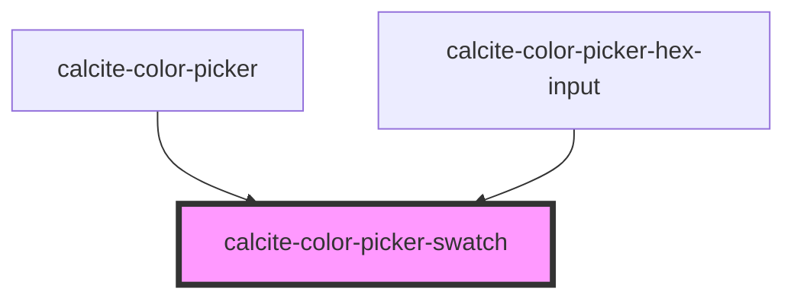

# my-component

<!-- Auto Generated Below -->

## Properties

| Property | Attribute | Description                                          | Type                | Default     |
| -------- | --------- | ---------------------------------------------------- | ------------------- | ----------- |
| `active` | `active`  | Used to display whether the swatch is active or not. | `boolean`           | `false`     |
| `color`  | `color`   | The color value.                                     | `string`            | `undefined` |
| `scale`  | `scale`   | The component scale.                                 | `"l" \| "m" \| "s"` | `"m"`       |
| `theme`  | `theme`   | The component's theme.                               | `"dark" \| "light"` | `"light"`   |

## Dependencies

### Used by

- [calcite-color-picker](../calcite-color-picker)
- [calcite-color-picker-hex-input](src/components/calcite-color-picker-hex-input)

### Graph

---

_Built with [StencilJS](https://stenciljs.com/)_
