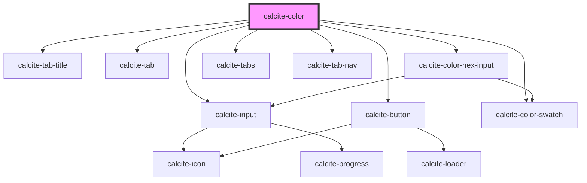

# my-component

<!-- Auto Generated Below -->

## Properties

| Property          | Attribute           | Description                                                                                                                                                                                            | Type                                                                                                     | Default                             |
| ----------------- | ------------------- | ------------------------------------------------------------------------------------------------------------------------------------------------------------------------------------------------------ | -------------------------------------------------------------------------------------------------------- | ----------------------------------- |
| `intlB`           | `intl-b`            | Label used for the blue channel                                                                                                                                                                        | `string`                                                                                                 | `TEXT.b`                            |
| `intlBlue`        | `intl-blue`         | Label used for the blue channel description                                                                                                                                                            | `string`                                                                                                 | `TEXT.blue`                         |
| `intlDeleteColor` | `intl-delete-color` | Label used for the delete color button.                                                                                                                                                                | `string`                                                                                                 | `TEXT.deleteColor`                  |
| `intlG`           | `intl-g`            | Label used for the green channel                                                                                                                                                                       | `string`                                                                                                 | `TEXT.g`                            |
| `intlGreen`       | `intl-green`        | Label used for the green channel description                                                                                                                                                           | `string`                                                                                                 | `TEXT.green`                        |
| `intlH`           | `intl-h`            | Label used for the hue channel                                                                                                                                                                         | `string`                                                                                                 | `TEXT.h`                            |
| `intlHex`         | `intl-hex`          | Label used for the hex input                                                                                                                                                                           | `string`                                                                                                 | `TEXT.hex`                          |
| `intlHsv`         | `intl-hsv`          | Label used for the HSV mode                                                                                                                                                                            | `string`                                                                                                 | `TEXT.hsv`                          |
| `intlHue`         | `intl-hue`          | Label used for the hue channel description                                                                                                                                                             | `string`                                                                                                 | `TEXT.hue`                          |
| `intlR`           | `intl-r`            | Label used for the red channel                                                                                                                                                                         | `string`                                                                                                 | `TEXT.r`                            |
| `intlRed`         | `intl-red`          | Label used for the red channel description                                                                                                                                                             | `string`                                                                                                 | `TEXT.red`                          |
| `intlRgb`         | `intl-rgb`          | Label used for the RGB mode                                                                                                                                                                            | `string`                                                                                                 | `TEXT.rgb`                          |
| `intlS`           | `intl-s`            | Label used for the saturation channel                                                                                                                                                                  | `string`                                                                                                 | `TEXT.s`                            |
| `intlSaturation`  | `intl-saturation`   | Label used for the saturation channel description                                                                                                                                                      | `string`                                                                                                 | `TEXT.saturation`                   |
| `intlSaveColor`   | `intl-save-color`   | Label used for the save color button.                                                                                                                                                                  | `string`                                                                                                 | `TEXT.saveColor`                    |
| `intlSaved`       | `intl-saved`        | Label used for the saved colors section                                                                                                                                                                | `string`                                                                                                 | `TEXT.saved`                        |
| `intlV`           | `intl-v`            | Label used for the value channel                                                                                                                                                                       | `string`                                                                                                 | `TEXT.v`                            |
| `intlValue`       | `intl-value`        | Label used for the                                                                                                                                                                                     | `string`                                                                                                 | `TEXT.value`                        |
| `scale`           | `scale`             | The scale of the color picker.                                                                                                                                                                         | `"l" \| "m" \| "s"`                                                                                      | `"m"`                               |
| `storageId`       | `storage-id`        | Storage ID for colors.                                                                                                                                                                                 | `string`                                                                                                 | `undefined`                         |
| `theme`           | `theme`             | The component's theme.                                                                                                                                                                                 | `"dark" \| "light"`                                                                                      | `"light"`                           |
| `value`           | `value`             | The color value.  This value can be either a {@link https://developer.mozilla.org/en-US/docs/Web/CSS/color\|CSS string} a RGB, HSL or HSV object.  The type will be preserved as the color is updated. | `HSL \| HSL & ObjectWithAlpha \| HSV \| HSV & ObjectWithAlpha \| RGB \| RGB & ObjectWithAlpha \| string` | `normalizeHex(DEFAULT_COLOR.hex())` |

## Events

| Event                | Description | Type               |
| -------------------- | ----------- | ------------------ |
| `calciteColorChange` |             | `CustomEvent<any>` |

## Methods

### `setFocus() => Promise<void>`

Sets focus on the component.

#### Returns

Type: `Promise<void>`

## Dependencies

### Depends on

- [calcite-tab-title](../calcite-tab-title)
- [calcite-tab](../calcite-tab)
- [calcite-input](../calcite-input)
- [calcite-color-hex-input](../calcite-color-hex-input)
- [calcite-tabs](../calcite-tabs)
- [calcite-tab-nav](../calcite-tab-nav)
- [calcite-button](../calcite-button)
- [calcite-color-swatch](../calcite-color-swatch)

### Graph

----------------------------------------------

*Built with [StencilJS](https://stenciljs.com/)*
