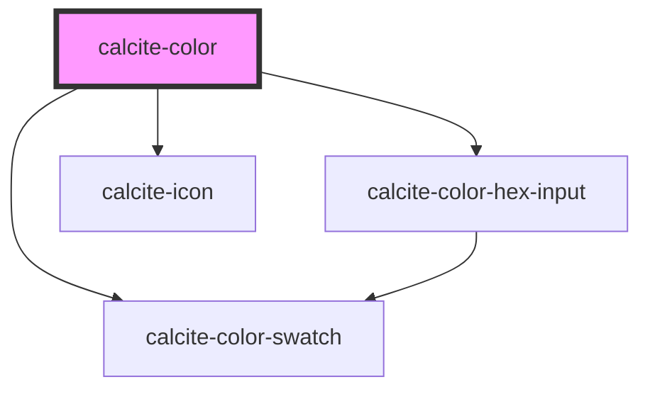

# my-component

<!-- Auto Generated Below -->

## Properties

| Property           | Attribute            | Description                                                                                                                                                                                          | Type                | Default                             |
| ------------------ | -------------------- | ---------------------------------------------------------------------------------------------------------------------------------------------------------------------------------------------------- | ------------------- | ----------------------------------- |
| `deleteColorLabel` | `delete-color-label` | Label used for the delete color button.                                                                                                                                                              | `string`            | `"Delete color"`                    |
| `intlB`            | `intl-b`             | Label used for the blue channel                                                                                                                                                                      | `string`            | `"B"`                               |
| `intlBlue`         | `intl-blue`          | Label used for the blue channel description                                                                                                                                                          | `string`            | `"Blue"`                            |
| `intlG`            | `intl-g`             | Label used for the green channel                                                                                                                                                                     | `string`            | `"G"`                               |
| `intlGreen`        | `intl-green`         | Label used for the green channel description                                                                                                                                                         | `string`            | `"Green"`                           |
| `intlH`            | `intl-h`             | Label used for the hue channel                                                                                                                                                                       | `string`            | `"H"`                               |
| `intlHex`          | `intl-hex`           | Label used for the hex input                                                                                                                                                                         | `string`            | `"Hex"`                             |
| `intlHsv`          | `intl-hsv`           | Label used for the HSV mode                                                                                                                                                                          | `string`            | `"HSV"`                             |
| `intlHue`          | `intl-hue`           | Label used for the hue channel description                                                                                                                                                           | `string`            | `"Hue"`                             |
| `intlR`            | `intl-r`             | Label used for the red channel                                                                                                                                                                       | `string`            | `"R"`                               |
| `intlRed`          | `intl-red`           | Label used for the red channel description                                                                                                                                                           | `string`            | `"Red"`                             |
| `intlRgb`          | `intl-rgb`           | Label used for the RGB mode                                                                                                                                                                          | `string`            | `"RGB"`                             |
| `intlS`            | `intl-s`             | Label used for the saturation channel                                                                                                                                                                | `string`            | `"S"`                               |
| `intlSaturation`   | `intl-saturation`    | Label used for the saturation channel description                                                                                                                                                    | `string`            | `"Saturation"`                      |
| `intlSavedColors`  | `intl-saved-colors`  | Label used for the                                                                                                                                                                                   | `string`            | `"Saved Colors"`                    |
| `intlV`            | `intl-v`             | Label used for the value channel                                                                                                                                                                     | `string`            | `"V"`                               |
| `intlValue`        | `intl-value`         | Label used for the                                                                                                                                                                                   | `string`            | `"Value"`                           |
| `saveColorLabel`   | `save-color-label`   | Label used for the save color button.                                                                                                                                                                | `string`            | `"Save color"`                      |
| `scale`            | `scale`              | The scale of the color picker.                                                                                                                                                                       | `"l" \| "m" \| "s"` | `"m"`                               |
| `storageId`        | `storage-id`         | Storage ID for colors.                                                                                                                                                                               | `string`            | `undefined`                         |
| `theme`            | `theme`              | The component's theme.                                                                                                                                                                               | `"dark" \| "light"` | `"light"`                           |
| `value`            | `value`              | The color value. This value can be either a {@link https://developer.mozilla.org/en-US/docs/Web/CSS/color\|CSS string} a RGB, HSL or HSV object. The type will be preserved as the color is updated. | `any`               | `normalizeHex(DEFAULT_COLOR.hex())` |

## Events

| Event                      | Description | Type               |
| -------------------------- | ----------- | ------------------ |
| `calciteColorPickerChange` |             | `CustomEvent<any>` |

## Methods

### `setFocus() => Promise<void>`

Sets focus on the component.

#### Returns

Type: `Promise<void>`

## Dependencies

### Depends on

- [calcite-color-hex-input](../calcite-color-hex-input)
- [calcite-icon](../calcite-icon)
- [calcite-color-swatch](../calcite-color-swatch)

### Graph

---

_Built with [StencilJS](https://stenciljs.com/)_
