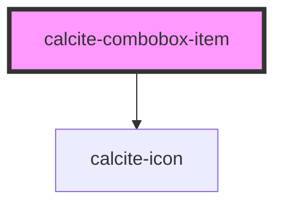

# calcite-combobox-item

<!-- Auto Generated Below -->

## Properties

| Property                 | Attribute     | Description | Type      | Default     |
| ------------------------ | ------------- | ----------- | --------- | ----------- |
| `disabled`               | `disabled`    |             | `boolean` | `false`     |
| `parentItem`             | `parent-item` |             | `any`     | `undefined` |
| `selected`               | `selected`    |             | `boolean` | `false`     |
| `textLabel` _(required)_ | `text-label`  |             | `string`  | `undefined` |
| `value` _(required)_     | `value`       |             | `string`  | `undefined` |

## Events

| Event                         | Description                                          | Type               |
| ----------------------------- | ---------------------------------------------------- | ------------------ |
| `calciteComboboxItemChange`   | Emitted whenever the item is selected or unselected. | `CustomEvent<any>` |
| `calciteComboboxItemKeyEvent` |                                                      | `CustomEvent<any>` |

## Methods

### `toggleSelected(coerce?: boolean) => Promise<void>`

Used to toggle the selection state. By default this won't trigger an event.
The first argument allows the value to be coerced, rather than swapping values.

#### Returns

Type: `Promise<void>`

## Dependencies

### Depends on

- [calcite-icon](../calcite-icon)

### Graph

---

_Built with [StencilJS](https://stenciljs.com/)_
