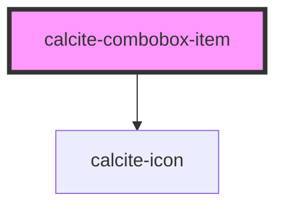

# calcite-combobox-item

<!-- Auto Generated Below -->

## Properties

| Property                 | Attribute    | Description                                                                         | Type      | Default     |
| ------------------------ | ------------ | ----------------------------------------------------------------------------------- | --------- | ----------- |
| `active`                 | `active`     | True when item is highlighted either from keyboard or mouse hover                   | `boolean` | `false`     |
| `ancestors`              | --           | Parent and grandparent combobox items, this is set internally for use from combobox | `any[]`   | `undefined` |
| `constant`               | `constant`   | Don't filter this item based on the search text                                     | `boolean` | `undefined` |
| `disabled`               | `disabled`   | When true, the item cannot be clicked and is visually muted.                        | `boolean` | `false`     |
| `guid`                   | `guid`       | Unique identifier, used for accessibility                                           | `string`  | `guid()`    |
| `icon`                   | `icon`       | Custom icon to display both in combobox chips and next to combobox item text        | `string`  | `undefined` |
| `selected`               | `selected`   | Set this to true to pre-select an item. Toggles when an item is checked/unchecked.  | `boolean` | `false`     |
| `textLabel` _(required)_ | `text-label` | The main label for this item.                                                       | `string`  | `undefined` |
| `value` _(required)_     | `value`      | The item's associated value                                                         | `any`     | `undefined` |

## Events

| Event                       | Description                                          | Type               |
| --------------------------- | ---------------------------------------------------- | ------------------ |
| `calciteComboboxItemChange` | Emitted whenever the item is selected or unselected. | `CustomEvent<any>` |

## Methods

### `toggleSelected(coerce?: boolean) => Promise<void>`

Used to toggle the selection state. By default this won't trigger an event.
The first argument allows the value to be coerced, rather than swapping values.

#### Returns

Type: `Promise<void>`

## Dependencies

### Depends on

- [calcite-icon](../calcite-icon)

### Graph

---

_Built with [StencilJS](https://stenciljs.com/)_
