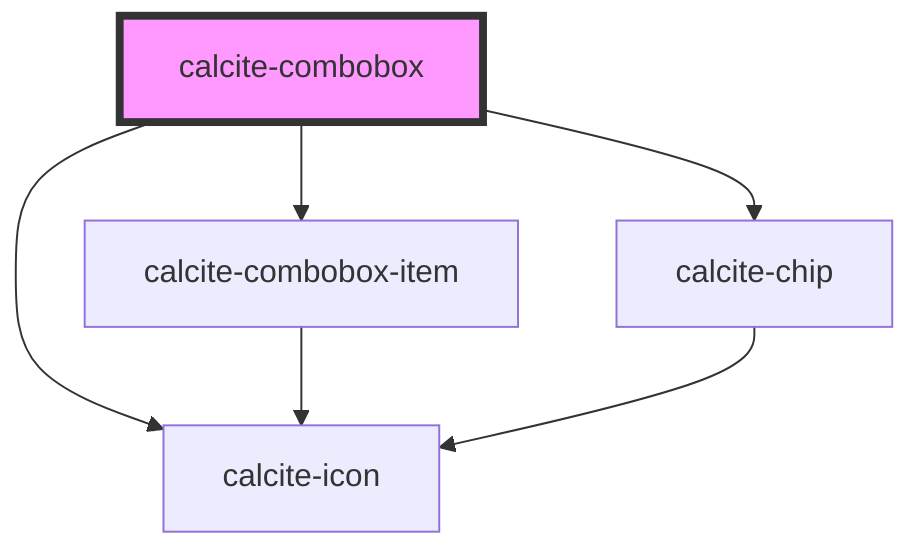

# calcite-combobox

<!-- Auto Generated Below -->

## Properties

| Property             | Attribute             | Description                                                                                                            | Type                  | Default     |
| -------------------- | --------------------- | ---------------------------------------------------------------------------------------------------------------------- | --------------------- | ----------- |
| `active`             | `active`              | Open and close combobox                                                                                                | `boolean`             | `false`     |
| `allowCustomValues`  | `allow-custom-values` | Allow entry of custom values which are not in the original set of items                                                | `boolean`             | `undefined` |
| `disabled`           | `disabled`            | Disable combobox input                                                                                                 | `boolean`             | `false`     |
| `label` _(required)_ | `label`               | Aria label for combobox (required)                                                                                     | `string`              | `undefined` |
| `maxItems`           | `max-items`           | Specify the maximum number of combobox items (including nested children) to display before showing the scroller        | `number`              | `0`         |
| `placeholder`        | `placeholder`         | Placeholder text for input                                                                                             | `string`              | `undefined` |
| `scale`              | `scale`               | Specify the scale of the combobox, defaults to m                                                                       | `"l" \| "m" \| "s"`   | `"m"`       |
| `selectionMode`      | `selection-mode`      | specify the selection mode - multi (allow any number of selected items), single (only one selction), defaults to multi | `"multi" \| "single"` | `"multi"`   |
| `theme`              | `theme`               | Select theme (light or dark)                                                                                           | `"dark" \| "light"`   | `undefined` |

## Events

| Event                        | Description                                | Type                                            |
| ---------------------------- | ------------------------------------------ | ----------------------------------------------- |
| `calciteComboboxChipDismiss` |                                            | `CustomEvent<any>`                              |
| `calciteLookupChange`        | Called when the selected items set changes | `CustomEvent<HTMLCalciteComboboxItemElement[]>` |

## Methods

### `reposition() => Promise<void>`

#### Returns

Type: `Promise<void>`

### `setFocus() => Promise<void>`

#### Returns

Type: `Promise<void>`

## Dependencies

### Depends on

- [calcite-combobox-item](../calcite-combobox-item)
- [calcite-chip](../calcite-chip)
- [calcite-icon](../calcite-icon)

### Graph

---

_Built with [StencilJS](https://stenciljs.com/)_
