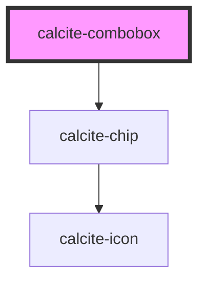

# calcite-combobox

<!-- Auto Generated Below -->

## Properties

| Property             | Attribute     | Description                                      | Type                | Default     |
| -------------------- | ------------- | ------------------------------------------------ | ------------------- | ----------- |
| `active`             | `active`      |                                                  | `boolean`           | `false`     |
| `disabled`           | `disabled`    |                                                  | `boolean`           | `false`     |
| `label` _(required)_ | `label`       |                                                  | `string`            | `undefined` |
| `placeholder`        | `placeholder` |                                                  | `string`            | `undefined` |
| `scale`              | `scale`       | specify the scale of the combobox, defaults to m | `"l" \| "m" \| "s"` | `"m"`       |
| `theme`              | `theme`       | Select theme (light or dark)                     | `"dark" \| "light"` | `undefined` |

## Events

| Event                        | Description | Type               |
| ---------------------------- | ----------- | ------------------ |
| `calciteComboboxChipDismiss` |             | `CustomEvent<any>` |
| `calciteLookupChange`        |             | `CustomEvent<any>` |

## Dependencies

### Depends on

- [calcite-chip](../calcite-chip)

### Graph

----------------------------------------------

*Built with [StencilJS](https://stenciljs.com/)*
