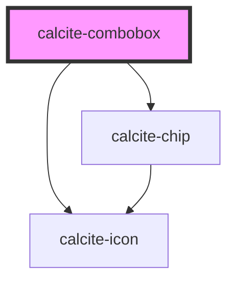

# calcite-combobox

<!-- Auto Generated Below -->

## Properties

| Property             | Attribute             | Description                                                                                                                                                                                                                    | Type                                 | Default      |
| -------------------- | --------------------- | ------------------------------------------------------------------------------------------------------------------------------------------------------------------------------------------------------------------------------ | ------------------------------------ | ------------ |
| `active`             | `active`              | Open and close combobox                                                                                                                                                                                                        | `boolean`                            | `false`      |
| `allowCustomValues`  | `allow-custom-values` | Allow entry of custom values which are not in the original set of items                                                                                                                                                        | `boolean`                            | `undefined`  |
| `disabled`           | `disabled`            | Disable combobox input                                                                                                                                                                                                         | `boolean`                            | `false`      |
| `label` _(required)_ | `label`               | Aria label for combobox (required)                                                                                                                                                                                             | `string`                             | `undefined`  |
| `maxItems`           | `max-items`           | Specify the maximum number of combobox items (including nested children) to display before showing the scroller                                                                                                                | `number`                             | `0`          |
| `overlayPositioning` | `overlay-positioning` | Describes the type of positioning to use for the overlaid content. If your element is in a fixed container, use the 'fixed' value.                                                                                             | `"absolute" \| "fixed"`              | `"absolute"` |
| `placeholder`        | `placeholder`         | Placeholder text for input                                                                                                                                                                                                     | `string`                             | `undefined`  |
| `scale`              | `scale`               | Specify the scale of the combobox, defaults to m                                                                                                                                                                               | `"l" \| "m" \| "s"`                  | `"m"`        |
| `selectionMode`      | `selection-mode`      | specify the selection mode - multi: allow any number of selected items (default) - single: only one selection) - ancestors: like multi, but show ancestors of selected items as selected, only deepest children shown in chips | `"ancestors" \| "multi" \| "single"` | `"multi"`    |

## Events

| Event                         | Description                                                              | Type                                                  |
| ----------------------------- | ------------------------------------------------------------------------ | ----------------------------------------------------- |
| `calciteComboboxChipDismiss`  | Called when a selected item in the combobox is dismissed via its chip \* | `CustomEvent<any>`                                    |
| `calciteComboboxFilterChange` | Called when the user has entered text to filter the options list         | `CustomEvent<{ visibleItems: any[]; text: string; }>` |
| `calciteLookupChange`         | Called when the selected items set changes                               | `CustomEvent<any[]>`                                  |

## Methods

### `reposition() => Promise<void>`

#### Returns

Type: `Promise<void>`

### `setFocus() => Promise<void>`

#### Returns

Type: `Promise<void>`

## Dependencies

### Depends on

- [calcite-chip](../calcite-chip)
- [calcite-icon](../calcite-icon)

### Graph

---

_Built with [StencilJS](https://stenciljs.com/)_
