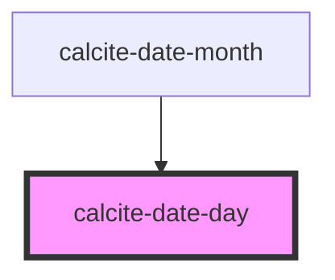

# calcite-date-day

<!-- Auto Generated Below -->

## Properties

| Property   | Attribute  | Description                                           | Type      | Default |
| ---------- | ---------- | ----------------------------------------------------- | --------- | ------- |
| `active`   | `active`   | Active tells whether day is Actively in focus.        | `boolean` | `false` |
| `day`      | `day`      | day of the month to be shown.                         | `number`  | `0`     |
| `enable`   | `enable`   | Enables tells whether day enabled for the user click. | `boolean` | `true`  |
| `selected` | `selected` | Selected tells whether day is selected.               | `boolean` | `false` |

## Events

| Event              | Description                               | Type               |
| ------------------ | ----------------------------------------- | ------------------ |
| `calciteDaySelect` | When user selects day it emits the event. | `CustomEvent<any>` |

## Dependencies

### Used by

 - [calcite-date-month](../calcite-date-month)

### Graph

----------------------------------------------

*Built with [StencilJS](https://stenciljs.com/)*
