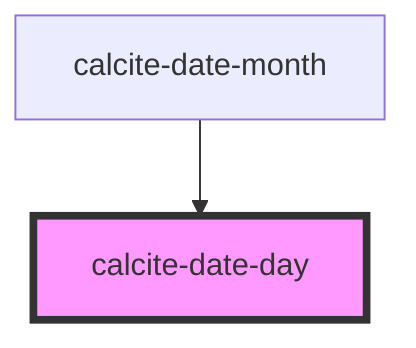

# calcite-date-day

<!-- Auto Generated Below -->

## Properties

| Property       | Attribute       | Description                                       | Type      | Default     |
| -------------- | --------------- | ------------------------------------------------- | --------- | ----------- |
| `active`       | `active`        | Date is actively in focus for keyboard navigation | `boolean` | `false`     |
| `currentMonth` | `current-month` | Date is in the current month.                     | `boolean` | `false`     |
| `day`          | `day`           | Day of the month to be shown.                     | `number`  | `undefined` |
| `disabled`     | `disabled`      | Date is outside of range and can't be selected    | `boolean` | `false`     |
| `locale`       | `locale`        | Locale to display the day in                      | `string`  | `undefined` |
| `selected`     | `selected`      | Date is the current selected date of the picker   | `boolean` | `false`     |

## Events

| Event              | Description                   | Type               |
| ------------------ | ----------------------------- | ------------------ |
| `calciteDaySelect` | Emitted when user selects day | `CustomEvent<any>` |

## Dependencies

### Used by

- [calcite-date-month](../calcite-date-month)

### Graph

---

_Built with [StencilJS](https://stenciljs.com/)_
