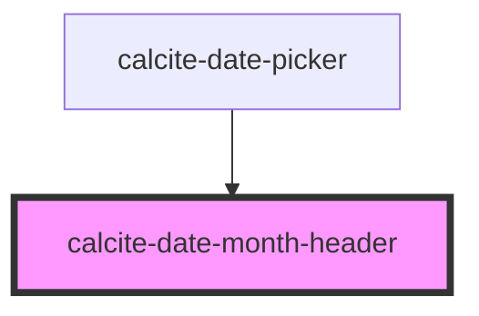

# calcite-date-month-header

<!-- Auto Generated Below -->

## Properties

| Property         | Attribute          | Description                                                                                                                                                                 | Type     | Default     |
| ---------------- | ------------------ | --------------------------------------------------------------------------------------------------------------------------------------------------------------------------- | -------- | ----------- |
| `locale`         | `locale`           |                                                                                                                                                                             | `string` | `"en-US"`   |
| `max`            | --                 |                                                                                                                                                                             | `Date`   | `undefined` |
| `min`            | --                 |                                                                                                                                                                             | `Date`   | `undefined` |
| `month`          | `month`            | Be sure to add a jsdoc comment describing your propery for the generated readme file. If your property should be hidden from documentation, you can use the `@internal` tag | `number` | `0`         |
| `nextMonthLabel` | `next-month-label` |                                                                                                                                                                             | `string` | `""`        |
| `prevMonthLabel` | `prev-month-label` |                                                                                                                                                                             | `string` | `""`        |
| `selectedDate`   | --                 |                                                                                                                                                                             | `Date`   | `undefined` |
| `year`           | `year`             |                                                                                                                                                                             | `number` | `0`         |

## Events

| Event                | Description | Type               |
| -------------------- | ----------- | ------------------ |
| `calciteMonthChange` |             | `CustomEvent<any>` |
| `calciteYearChange`  |             | `CustomEvent<any>` |

## Dependencies

### Used by

 - [calcite-date-picker](../..)

### Graph

----------------------------------------------

*Built with [StencilJS](https://stenciljs.com/)*
