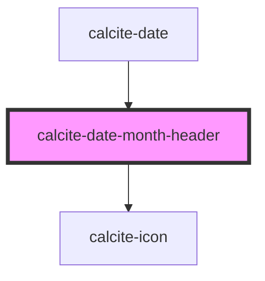

# calcite-date-month-header

<!-- Auto Generated Below -->

## Properties

| Property         | Attribute          | Description                                                              | Type     | Default     |
| ---------------- | ------------------ | ------------------------------------------------------------------------ | -------- | ----------- |
| `activeDate`     | --                 | Focused date with indicator (will become selected date if user proceeds) | `Date`   | `undefined` |
| `locale`         | `locale`           | User's language and region as BCP 47 formatted string.                   | `string` | `undefined` |
| `max`            | --                 | Maximum date of the calendar above which is disabled.                    | `Date`   | `undefined` |
| `min`            | --                 | Minimum date of the calendar below which is disabled.                    | `Date`   | `undefined` |
| `nextMonthLabel` | `next-month-label` | Localized string for next month.                                         | `string` | `undefined` |
| `prevMonthLabel` | `prev-month-label` | Localized string for previous month.                                     | `string` | `undefined` |
| `selectedDate`   | --                 | Already selected date.                                                   | `Date`   | `undefined` |

## Events

| Event                     | Description            | Type               |
| ------------------------- | ---------------------- | ------------------ |
| `calciteActiveDateChange` | Changes to active date | `CustomEvent<any>` |

## Dependencies

### Used by

 - [calcite-date](../calcite-date)

### Depends on

- [calcite-icon](../calcite-icon)

### Graph

----------------------------------------------

*Built with [StencilJS](https://stenciljs.com/)*
