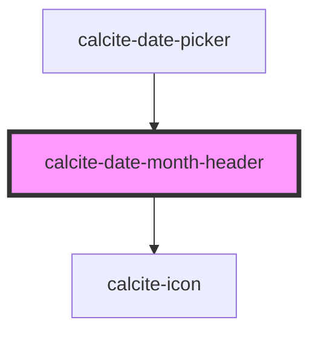

# calcite-date-month-header

<!-- Auto Generated Below -->

## Properties

| Property         | Attribute          | Description                                                         | Type     | Default                    |
| ---------------- | ------------------ | ------------------------------------------------------------------- | -------- | -------------------------- |
| `locale`         | `locale`           | pass the locale in which user wants to show the date.               | `string` | `undefined`                |
| `max`            | --                 | Maximum date of the calendar above which is disabled.               | `Date`   | `undefined`                |
| `min`            | --                 | Minimum date of the calendar below which is disabled.               | `Date`   | `undefined`                |
| `month`          | `month`            | Month number starting 0 as January for which the calendar is shown. | `number` | `new Date().getMonth()`    |
| `nextMonthLabel` | `next-month-label` | Localized string for next month.                                    | `string` | `undefined`                |
| `prevMonthLabel` | `prev-month-label` | Localized string for previous month.                                | `string` | `undefined`                |
| `selectedDate`   | --                 | Already selected date.                                              | `Date`   | `undefined`                |
| `year`           | `year`             | Year for which the calendar is shown.                               | `number` | `new Date().getFullYear()` |

## Events

| Event                | Description                             | Type               |
| -------------------- | --------------------------------------- | ------------------ |
| `calciteMonthChange` | Event triggered when user change month. | `CustomEvent<any>` |
| `calciteYearChange`  | Event triggered when user change year.  | `CustomEvent<any>` |

## Dependencies

### Used by

 - [calcite-date-picker](../calcite-date-picker)

### Depends on

- [calcite-icon](../calcite-icon)

### Graph

----------------------------------------------

*Built with [StencilJS](https://stenciljs.com/)*
