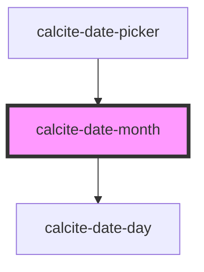

# calcite-date-month

<!-- Auto Generated Below -->

## Properties

| Property       | Attribute       | Description                                                                                  | Type     | Default     |
| -------------- | --------------- | -------------------------------------------------------------------------------------------- | -------- | ----------- |
| `activeDate`   | --              | Date currently active.                                                                       | `Date`   | `undefined` |
| `locale`       | `locale`        | pass the locale in which user wants to show the date.                                        | `string` | `"en-US"`   |
| `max`          | --              | Maximum date of the calendar above which is disabled.                                        | `Date`   | `undefined` |
| `min`          | --              | Minimum date of the calendar below which is disabled.                                        | `Date`   | `undefined` |
| `month`        | `month`         | Month number starting 0 as January for which the calendar is shown.                          | `number` | `0`         |
| `selectedDate` | --              | Already selected date.                                                                       | `Date`   | `undefined` |
| `startOfWeek`  | `start-of-week` | Sun by default 0: Sunday 1: Monday 2: Tuesday 3: Wednesday 4: Thursday 5: Friday 6: Saturday | `number` | `0`         |
| `year`         | `year`          | Year for which the calendar is shown.                                                        | `number` | `0`         |

## Events

| Event                     | Description                               | Type               |
| ------------------------- | ----------------------------------------- | ------------------ |
| `calciteActiveDateChange` | Active date for the user keyboard access. | `CustomEvent<any>` |
| `calciteDateSelect`       | Event emitted when user selects the date. | `CustomEvent<any>` |

## Dependencies

### Used by

 - [calcite-date-picker](../calcite-date-picker)

### Depends on

- [calcite-date-day](../calcite-date-day)

### Graph

----------------------------------------------

*Built with [StencilJS](https://stenciljs.com/)*
