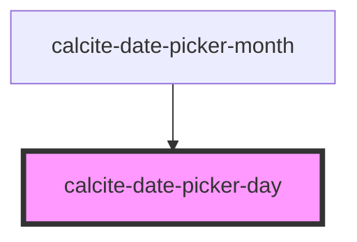

# calcite-date-day

<!-- Auto Generated Below -->

## Properties

| Property       | Attribute        | Description                                        | Type                | Default     |
| -------------- | ---------------- | -------------------------------------------------- | ------------------- | ----------- |
| `active`       | `active`         | Date is actively in focus for keyboard navigation  | `boolean`           | `false`     |
| `currentMonth` | `current-month`  | Date is in the current month.                      | `boolean`           | `false`     |
| `day`          | `day`            | Day of the month to be shown.                      | `number`            | `undefined` |
| `disabled`     | `disabled`       | Date is outside of range and can't be selected     | `boolean`           | `false`     |
| `endOfRange`   | `end-of-range`   | Date is the end of date range                      | `boolean`           | `false`     |
| `highlighted`  | `highlighted`    | Date is currently highlighted as part of the range | `boolean`           | `false`     |
| `localeData`   | --               | CLDR data for current locale                       | `DateLocaleData`    | `undefined` |
| `range`        | `range`          | Showing date range                                 | `boolean`           | `false`     |
| `rangeHover`   | `range-hover`    |                                                    | `boolean`           | `false`     |
| `scale`        | `scale`          | specify the scale of the date picker               | `"l" \| "m" \| "s"` | `undefined` |
| `selected`     | `selected`       | Date is the current selected date of the picker    | `boolean`           | `false`     |
| `startOfRange` | `start-of-range` | Date is the start of date range                    | `boolean`           | `false`     |
| `value`        | --               | Date value for the day.                            | `Date`              | `undefined` |

## Events

| Event              | Description                         | Type               |
| ------------------ | ----------------------------------- | ------------------ |
| `calciteDayHover`  | Emitted when user hovers over a day | `CustomEvent<any>` |
| `calciteDaySelect` | Emitted when user selects day       | `CustomEvent<any>` |

## Dependencies

### Used by

- [calcite-date-picker-month](../calcite-date-picker-month)

### Graph

---

_Built with [StencilJS](https://stenciljs.com/)_
