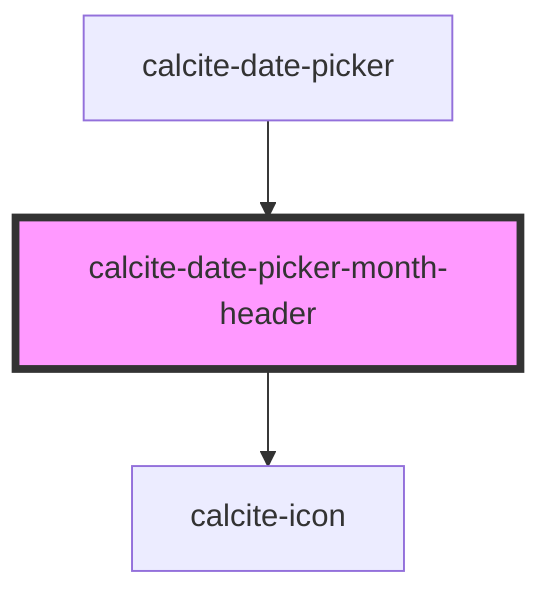

# calcite-date-month-header

<!-- Auto Generated Below -->

## Properties

| Property        | Attribute         | Description                                                              | Type                         | Default     |
| --------------- | ----------------- | ------------------------------------------------------------------------ | ---------------------------- | ----------- |
| `activeDate`    | --                | Focused date with indicator (will become selected date if user proceeds) | `Date`                       | `undefined` |
| `headingLevel`  | `heading-level`   | Number at which section headings should start for this component.        | `1 \| 2 \| 3 \| 4 \| 5 \| 6` | `undefined` |
| `intlNextMonth` | `intl-next-month` | Localized string for next month.                                         | `string`                     | `undefined` |
| `intlPrevMonth` | `intl-prev-month` | Localized string for previous month.                                     | `string`                     | `undefined` |
| `locale`        | `locale`          | User's language and region as BCP 47 formatted string.                   | `string`                     | `undefined` |
| `localeData`    | --                | CLDR locale data for translated calendar info                            | `DateLocaleData`             | `undefined` |
| `max`           | --                | Maximum date of the calendar above which is disabled.                    | `Date`                       | `undefined` |
| `min`           | --                | Minimum date of the calendar below which is disabled.                    | `Date`                       | `undefined` |
| `scale`         | `scale`           | specify the scale of the date picker                                     | `"l" \| "m" \| "s"`          | `undefined` |
| `selectedDate`  | --                | Already selected date.                                                   | `Date`                       | `undefined` |

## Events

| Event                     | Description            | Type                |
| ------------------------- | ---------------------- | ------------------- |
| `calciteDatePickerSelect` | Changes to active date | `CustomEvent<Date>` |

## Dependencies

### Used by

- [calcite-date-picker](../calcite-date-picker)

### Depends on

- [calcite-icon](../calcite-icon)

### Graph

---

_Built with [StencilJS](https://stenciljs.com/)_
