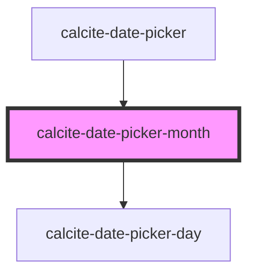

# calcite-date-month

<!-- Auto Generated Below -->

## Properties

| Property       | Attribute     | Description                                           | Type                | Default      |
| -------------- | ------------- | ----------------------------------------------------- | ------------------- | ------------ |
| `activeDate`   | --            | Date currently active.                                | `Date`              | `new Date()` |
| `endDate`      | --            | End date currently active                             | `Date`              | `undefined`  |
| `hoverRange`   | `hover-range` |                                                       | `any`               | `undefined`  |
| `max`          | --            | Maximum date of the calendar above which is disabled. | `Date`              | `undefined`  |
| `min`          | --            | Minimum date of the calendar below which is disabled. | `Date`              | `undefined`  |
| `scale`        | `scale`       | specify the scale of the date picker                  | `"l" \| "m" \| "s"` | `undefined`  |
| `selectedDate` | --            | Already selected date.                                | `Date`              | `undefined`  |
| `startDate`    | --            | Start date currently active.                          | `Date`              | `undefined`  |

## Events

| Event                               | Description                               | Type               |
| ----------------------------------- | ----------------------------------------- | ------------------ |
| `calciteDatePickerActiveDateChange` | Active date for the user keyboard access. | `CustomEvent<any>` |
| `calciteDatePickerHover`            | Event emitted when user hovers the date.  | `CustomEvent<any>` |
| `calciteDatePickerMouseOut`         |                                           | `CustomEvent<any>` |
| `calciteDatePickerSelect`           | Event emitted when user selects the date. | `CustomEvent<any>` |

## Dependencies

### Used by

- [calcite-date-picker](../calcite-date-picker)

### Depends on

- [calcite-date-picker-day](../calcite-date-picker-day)

### Graph

---

_Built with [StencilJS](https://stenciljs.com/)_
