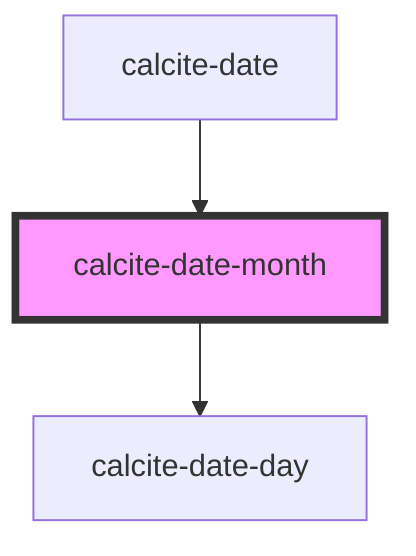

# calcite-date-month

<!-- Auto Generated Below -->

## Properties

| Property       | Attribute | Description                                           | Type                | Default      |
| -------------- | --------- | ----------------------------------------------------- | ------------------- | ------------ |
| `activeDate`   | --        | Date currently active.                                | `Date`              | `new Date()` |
| `max`          | --        | Maximum date of the calendar above which is disabled. | `Date`              | `undefined`  |
| `min`          | --        | Minimum date of the calendar below which is disabled. | `Date`              | `undefined`  |
| `scale`        | `scale`   | specify the scale of the date picker                  | `"l" \| "m" \| "s"` | `undefined`  |
| `selectedDate` | --        | Already selected date.                                | `Date`              | `undefined`  |

## Events

| Event                     | Description                               | Type               |
| ------------------------- | ----------------------------------------- | ------------------ |
| `calciteActiveDateChange` | Active date for the user keyboard access. | `CustomEvent<any>` |
| `calciteDateSelect`       | Event emitted when user selects the date. | `CustomEvent<any>` |

## Dependencies

### Used by

- [calcite-date](../calcite-date)

### Depends on

- [calcite-date-day](../calcite-date-day)

### Graph

---

_Built with [StencilJS](https://stenciljs.com/)_
