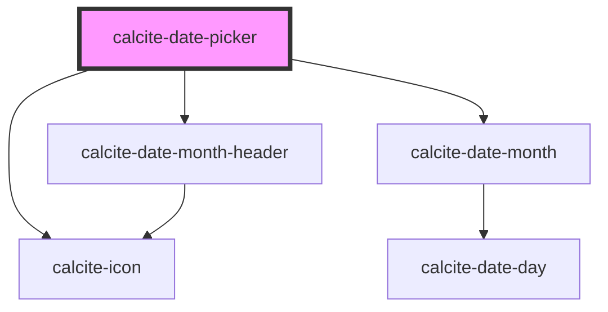

# calcite-date

<!-- Auto Generated Below -->

## Properties

| Property          | Attribute           | Description                                                 | Type      | Default            |
| ----------------- | ------------------- | ----------------------------------------------------------- | --------- | ------------------ |
| `locale`          | `locale`            | BCP 47 language tag for desired language and country format | `string`  | `"en-US"`          |
| `max`             | `max`               | Latest allowed date ("yyyy-mm-dd")                          | `string`  | `undefined`        |
| `min`             | `min`               | Earliest allowed date ("yyyy-mm-dd")                        | `string`  | `undefined`        |
| `nextMonthLabel`  | `next-month-label`  | Localized string for "next month"                           | `string`  | `"next month"`     |
| `noCalendarInput` | `no-calendar-input` | Show only calendar popup                                    | `boolean` | `false`            |
| `prevMonthLabel`  | `prev-month-label`  | Localized string for "previous month"                       | `string`  | `"previous month"` |
| `showCalendar`    | `show-calendar`     | Expand or collapse when calendar does not have input        | `boolean` | `false`            |
| `value`           | `value`             | Selected date                                               | `string`  | `undefined`        |
| `valueAsDate`     | --                  | Selected date as full date object                           | `Date`    | `undefined`        |

## Events

| Event               | Description                                               | Type               |
| ------------------- | --------------------------------------------------------- | ------------------ |
| `calciteDateChange` | Trigger calcite date change when a user changes the date. | `CustomEvent<any>` |

## Dependencies

### Depends on

- [calcite-icon](../calcite-icon)
- [calcite-date-month-header](../calcite-date-month-header)
- [calcite-date-month](../calcite-date-month)

### Graph

----------------------------------------------

*Built with [StencilJS](https://stenciljs.com/)*
