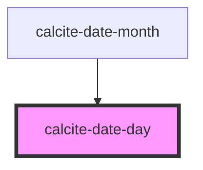

# calcite-date-day

<!-- Auto Generated Below -->

## Properties

| Property   | Attribute  | Description                                                                                                                                                                 | Type      | Default |
| ---------- | ---------- | --------------------------------------------------------------------------------------------------------------------------------------------------------------------------- | --------- | ------- |
| `day`      | `day`      | Be sure to add a jsdoc comment describing your propery for the generated readme file. If your property should be hidden from documentation, you can use the `@internal` tag | `number`  | `0`     |
| `enable`   | `enable`   |                                                                                                                                                                             | `boolean` | `true`  |
| `selected` | `selected` |                                                                                                                                                                             | `boolean` | `false` |

## Events

| Event              | Description | Type               |
| ------------------ | ----------- | ------------------ |
| `calciteDaySelect` |             | `CustomEvent<any>` |

## Dependencies

### Used by

 - [calcite-date-month](../calcite-date-month)

### Graph

----------------------------------------------

*Built with [StencilJS](https://stenciljs.com/)*
