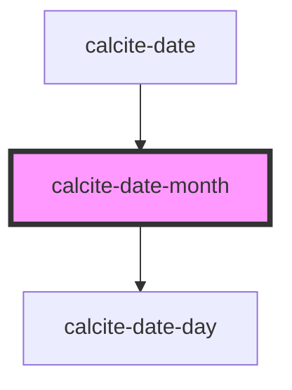

# calcite-date-month

<!-- Auto Generated Below -->

## Properties

| Property       | Attribute       | Description                                                                                                                                                                 | Type     | Default     |
| -------------- | --------------- | --------------------------------------------------------------------------------------------------------------------------------------------------------------------------- | -------- | ----------- |
| `locale`       | `locale`        |                                                                                                                                                                             | `string` | `"en-US"`   |
| `month`        | `month`         | Be sure to add a jsdoc comment describing your propery for the generated readme file. If your property should be hidden from documentation, you can use the `@internal` tag | `number` | `0`         |
| `selectedDate` | --              |                                                                                                                                                                             | `Date`   | `undefined` |
| `startOfWeek`  | `start-of-week` | Sun by default 0: Sunday 1: Monday 2: Tuesday 3: Wednesday 4: Thursday 5: Friday 6: Saturday                                                                                | `number` | `0`         |
| `year`         | `year`          |                                                                                                                                                                             | `number` | `0`         |

## Events

| Event               | Description | Type               |
| ------------------- | ----------- | ------------------ |
| `calciteDateSelect` |             | `CustomEvent<any>` |

## Dependencies

### Used by

 - [calcite-date](../..)

### Depends on

- [calcite-date-day](../calcite-date-day)

### Graph

----------------------------------------------

*Built with [StencilJS](https://stenciljs.com/)*
