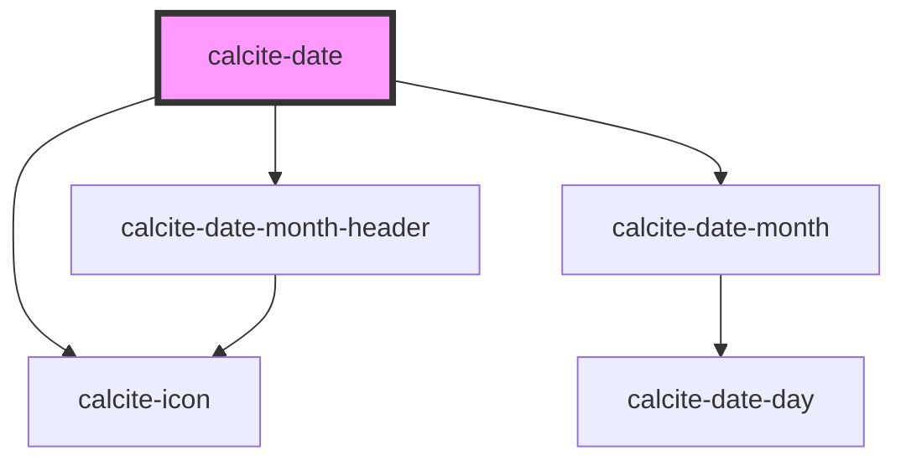

# calcite-date

The `calcite-date` component allows for selecting a date via a calendar or text input. It supports multiple locales, languages, right to left, and is fully keyboard accessible.

You can set a min and max range, as well as an initial value with ISO 8601 formatted strings:

```html
<calcite-date value="2020-03-27" min="2020-02-01" max="2021-01-01" />
```

Date also supports passing in a proxy input to make event handling and binding easier for frameworks like React:

```html
<calcite-date>
  <input type="date" />
</calcite-date>
```

<!-- Auto Generated Below -->


## Properties

| Property          | Attribute           | Description                                                 | Type      | Default            |
| ----------------- | ------------------- | ----------------------------------------------------------- | --------- | ------------------ |
| `locale`          | `locale`            | BCP 47 language tag for desired language and country format | `string`  | `"en-US"`          |
| `max`             | `max`               | Latest allowed date ("yyyy-mm-dd")                          | `string`  | `undefined`        |
| `min`             | `min`               | Earliest allowed date ("yyyy-mm-dd")                        | `string`  | `undefined`        |
| `nextMonthLabel`  | `next-month-label`  | Localized string for "next month"                           | `string`  | `"next month"`     |
| `noCalendarInput` | `no-calendar-input` | Show only calendar popup                                    | `boolean` | `false`            |
| `prevMonthLabel`  | `prev-month-label`  | Localized string for "previous month"                       | `string`  | `"previous month"` |
| `showCalendar`    | `show-calendar`     | Expand or collapse when calendar does not have input        | `boolean` | `false`            |
| `value`           | `value`             | Selected date                                               | `string`  | `undefined`        |
| `valueAsDate`     | --                  | Selected date as full date object                           | `Date`    | `undefined`        |


## Events

| Event               | Description                                               | Type               |
| ------------------- | --------------------------------------------------------- | ------------------ |
| `calciteDateChange` | Trigger calcite date change when a user changes the date. | `CustomEvent<any>` |


## Dependencies

### Depends on

- [calcite-icon](../calcite-icon)
- [calcite-date-month-header](../calcite-date-month-header)
- [calcite-date-month](../calcite-date-month)

### Graph


----------------------------------------------

*Built with [StencilJS](https://stenciljs.com/)*
