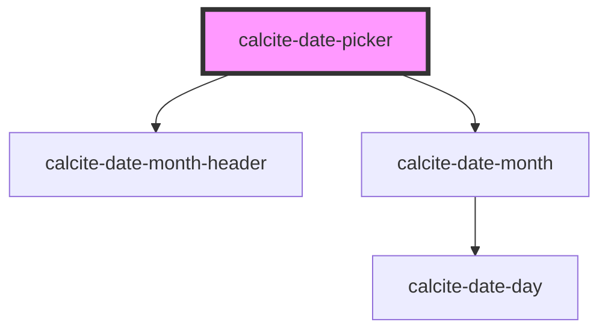

# calcite-date

<!-- Auto Generated Below -->

## Properties

| Property         | Attribute          | Description                                                                                  | Type     | Default   |
| ---------------- | ------------------ | -------------------------------------------------------------------------------------------- | -------- | --------- |
| `locale`         | `locale`           | pass the locale in which user wants to show the date.                                        | `string` | `"en-US"` |
| `max`            | `max`              | Value of the form control                                                                    | `string` | `""`      |
| `min`            | `min`              | Name of the form control (useful for specifying input/label relationship)                    | `string` | `""`      |
| `nextMonthLabel` | `next-month-label` | Localized string for next month.                                                             | `string` | `""`      |
| `prevMonthLabel` | `prev-month-label` | Localized string for previous month.                                                         | `string` | `""`      |
| `startOfWeek`    | `start-of-week`    | Sun by default 0: Sunday 1: Monday 2: Tuesday 3: Wednesday 4: Thursday 5: Friday 6: Saturday | `number` | `0`       |
| `value`          | `value`            | Value of the form control                                                                    | `string` | `""`      |

## Events

| Event               | Description                                               | Type               |
| ------------------- | --------------------------------------------------------- | ------------------ |
| `calciteDateChange` | Trigger calcite date change when a user changes the date. | `CustomEvent<any>` |

## Dependencies

### Depends on

- [calcite-date-month-header](../calcite-date-month-header)
- [calcite-date-month](../calcite-date-month)

### Graph

----------------------------------------------

*Built with [StencilJS](https://stenciljs.com/)*
