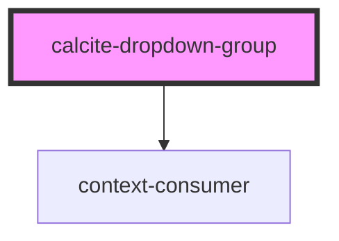

# calcite-dropdown-group

<!-- Auto Generated Below -->

## Properties

| Property     | Attribute     | Description                              | Type     | Default |
| ------------ | ------------- | ---------------------------------------- | -------- | ------- |
| `groupTitle` | `group-title` | optionally set a group title for display | `string` | `null`  |

## Events

| Event                           | Description | Type               |
| ------------------------------- | ----------- | ------------------ |
| `calciteDropdownItemHasChanged` |             | `CustomEvent<any>` |
| `registerCalciteDropdownGroup`  |             | `CustomEvent<any>` |

## Dependencies

### Depends on

- context-consumer

### Graph

----------------------------------------------

*Built with [StencilJS](https://stenciljs.com/)*
