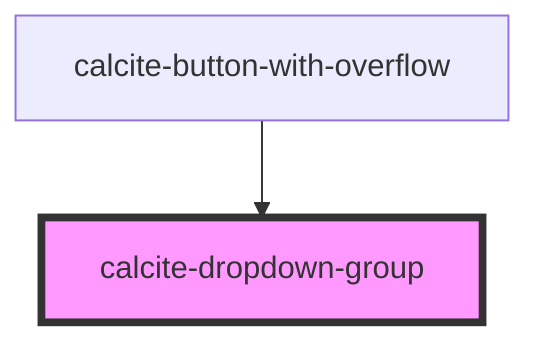

# calcite-dropdown-group

<!-- Auto Generated Below -->

## Properties

| Property        | Attribute        | Description                                                                                                                                                           | Type                            | Default     |
| --------------- | ---------------- | --------------------------------------------------------------------------------------------------------------------------------------------------------------------- | ------------------------------- | ----------- |
| `groupTitle`    | `group-title`    | optionally set a group title for display                                                                                                                              | `string`                        | `undefined` |
| `selectionMode` | `selection-mode` | specify the selection mode - multi (allow any number of (or no) active items), single (allow and require one active item), none (no active items), defaults to single | `"multi" \| "none" \| "single"` | `"single"`  |

## Events

| Event                           | Description | Type               |
| ------------------------------- | ----------- | ------------------ |
| `calciteDropdownItemHasChanged` |             | `CustomEvent<any>` |
| `registerCalciteDropdownGroup`  |             | `CustomEvent<any>` |

## Dependencies

### Used by

 - [calcite-button-with-overflow](../calcite-button-with-overflow)

### Graph

----------------------------------------------

*Built with [StencilJS](https://stenciljs.com/)*
