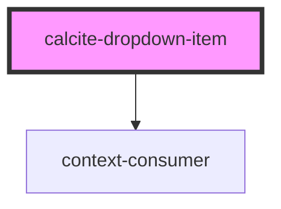

# calcite-dropdown-item

<!-- Auto Generated Below -->

## Properties

| Property | Attribute | Description | Type      | Default |
| -------- | --------- | ----------- | --------- | ------- |
| `active` | `active`  |             | `boolean` | `false` |

## Events

| Event                         | Description | Type               |
| ----------------------------- | ----------- | ------------------ |
| `calciteDropdownItemKeyEvent` |             | `CustomEvent<any>` |
| `calciteDropdownItemSelected` |             | `CustomEvent<any>` |
| `closeCalciteDropdown`        |             | `CustomEvent<any>` |
| `registerCalciteDropdownItem` |             | `CustomEvent<any>` |

## Dependencies

### Depends on

- context-consumer

### Graph

----------------------------------------------

*Built with [StencilJS](https://stenciljs.com/)*
