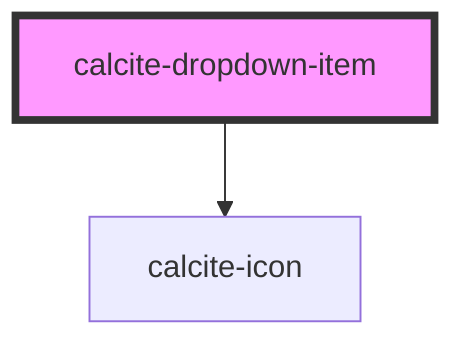

# calcite-dropdown-item

<!-- Auto Generated Below -->

## Properties

| Property      | Attribute       | Description                                                                                | Type                         | Default     |
| ------------- | --------------- | ------------------------------------------------------------------------------------------ | ---------------------------- | ----------- |
| `active`      | `active`        | Indicates whether the item is active.                                                      | `boolean`                    | `false`     |
| `href`        | `href`          | optionally pass a href - used to determine if the component should render as anchor        | `string`                     | `undefined` |
| `iconEnd`     | `icon-end`      | optionally pass an icon to display at the end of an item - accepts calcite ui icon names   | `string`                     | `undefined` |
| `iconFlipRtl` | `icon-flip-rtl` | flip the icon(s) in rtl                                                                    | `"both" \| "end" \| "start"` | `undefined` |
| `iconStart`   | `icon-start`    | optionally pass an icon to display at the start of an item - accepts calcite ui icon names | `string`                     | `undefined` |
| `label`       | `label`         | Applies to the aria-label attribute on the button or hyperlink                             | `string`                     | `undefined` |
| `rel`         | `rel`           | The rel attribute to apply to the hyperlink                                                | `string`                     | `undefined` |
| `target`      | `target`        | The target attribute to apply to the hyperlink                                             | `string`                     | `undefined` |

## Methods

### `setFocus() => Promise<void>`

Sets focus on the component.

#### Returns

Type: `Promise<void>`

## Slots

| Slot | Description             |
| ---- | ----------------------- |
|      | A slot for adding text. |

## Dependencies

### Depends on

- [calcite-icon](../calcite-icon)

### Graph

---

_Built with [StencilJS](https://stenciljs.com/)_
