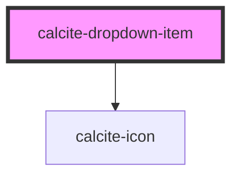

# calcite-dropdown-item

<!-- Auto Generated Below -->

## Properties

| Property    | Attribute    | Description                                                                                | Type      | Default     |
| ----------- | ------------ | ------------------------------------------------------------------------------------------ | --------- | ----------- |
| `active`    | `active`     |                                                                                            | `boolean` | `false`     |
| `href`      | `href`       | pass an optional href to render an anchor around the link items                            | `string`  | `undefined` |
| `iconEnd`   | `icon-end`   | optionally pass an icon to display at the end of an item - accepts calcite ui icon names   | `string`  | `undefined` |
| `iconStart` | `icon-start` | optionally pass an icon to display at the start of an item - accepts calcite ui icon names | `string`  | `undefined` |
| `linkTitle` | `link-title` | pass an optional title for rendered href                                                   | `string`  | `undefined` |

## Events

| Event                          | Description | Type               |
| ------------------------------ | ----------- | ------------------ |
| `calciteDropdownItemKeyEvent`  |             | `CustomEvent<any>` |
| `calciteDropdownItemMouseover` |             | `CustomEvent<any>` |
| `calciteDropdownItemSelected`  |             | `CustomEvent<any>` |
| `closeCalciteDropdown`         |             | `CustomEvent<any>` |
| `registerCalciteDropdownItem`  |             | `CustomEvent<any>` |

## Dependencies

### Depends on

- [calcite-icon](../calcite-icon)

### Graph

----------------------------------------------

*Built with [StencilJS](https://stenciljs.com/)*
