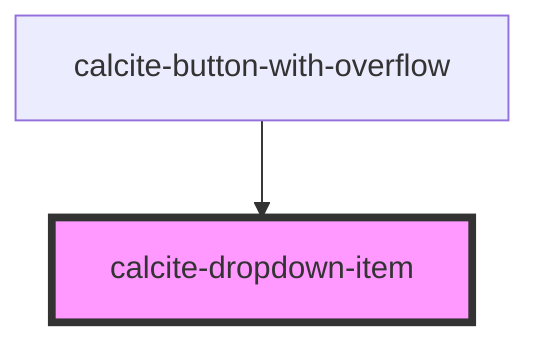

# calcite-dropdown-item

<!-- Auto Generated Below -->

## Properties

| Property    | Attribute    | Description                                                     | Type      | Default     |
| ----------- | ------------ | --------------------------------------------------------------- | --------- | ----------- |
| `active`    | `active`     |                                                                 | `boolean` | `false`     |
| `href`      | `href`       | pass an optional href to render an anchor around the link items | `string`  | `undefined` |
| `linkTitle` | `link-title` | pass an optional title for rendered href                        | `string`  | `undefined` |

## Events

| Event                          | Description | Type               |
| ------------------------------ | ----------- | ------------------ |
| `calciteDropdownItemKeyEvent`  |             | `CustomEvent<any>` |
| `calciteDropdownItemMouseover` |             | `CustomEvent<any>` |
| `calciteDropdownItemSelected`  |             | `CustomEvent<any>` |
| `closeCalciteDropdown`         |             | `CustomEvent<any>` |
| `registerCalciteDropdownItem`  |             | `CustomEvent<any>` |

## Dependencies

### Used by

 - [calcite-button-with-overflow](../calcite-button-with-overflow)

### Graph

----------------------------------------------

*Built with [StencilJS](https://stenciljs.com/)*
