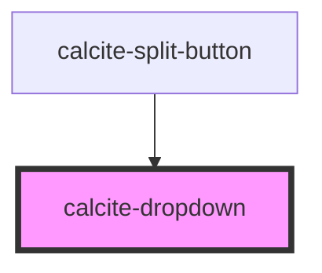

# calcite-dropdown

A `calcite-dropdown` can be used to provide an absolutely positioned set of selectable items. You can combine multiple groups of items and selection modes, and optionally pass a title for each group. All `<calcite-dropdown-item>` must have a parent `<calcite-dropdown-group>`, even if `group-title` attribute is not set.

<!-- Auto Generated Below -->

## Usage

### Basic

```html
<calcite-dropdown>
  <calcite-button slot="dropdown-trigger">Open Dropdown</calcite-button>
  <calcite-dropdown-group>
    <calcite-dropdown-item>Relevance</calcite-dropdown-item>
    <calcite-dropdown-item active>Date modified</calcite-dropdown-item>
    <calcite-dropdown-item>Title</calcite-dropdown-item>
  </calcite-dropdown-group>
</calcite-dropdown>
```

### Disabling-close-on-select

You can choose to leave the dropdown open when an item is selected with the `disable-close-on-select` attribute. Note that this will only apply when the `calcite-dropdown-group` selection mode is set to `single` or `multi` - dropdowns will always close when an item in `none` selection mode is selected.

```html
<calcite-dropdown disable-close-on-select>
  <calcite-button id="trigger" slot="dropdown-trigger">Open dropdown</calcite-button>
  <calcite-dropdown-group id="group-1" selection-mode="single">
    <calcite-dropdown-item id="item-1"> Dropdown Item Content </calcite-dropdown-item>
    <calcite-dropdown-item id="item-2" active> Dropdown Item Content </calcite-dropdown-item>
    <calcite-dropdown-item id="item-3"> Dropdown Item Content </calcite-dropdown-item>
  </calcite-dropdown-group>
</calcite-dropdown>
```

### Groups

You can combine groups in a single dropdown, with varying selection modes:

```html
<calcite-dropdown>
  <calcite-button slot="dropdown-trigger">Open Dropdown</calcite-button>
  <calcite-dropdown-group group-title="Select one">
    <calcite-dropdown-item>Apple</calcite-dropdown-item>
    <calcite-dropdown-item active>Orange</calcite-dropdown-item>
    <calcite-dropdown-item>Grape</calcite-dropdown-item>
  </calcite-dropdown-group>
  <calcite-dropdown-group group-title="Select multi" selection-mode="multi">
    <calcite-dropdown-item>Asparagus</calcite-dropdown-item>
    <calcite-dropdown-item active>Potato</calcite-dropdown-item>
    <calcite-dropdown-item>Yam</calcite-dropdown-item>
  </calcite-dropdown-group>
  <calcite-dropdown-group group-title="Select none (useful for actions)" selection-mode="none">
    <calcite-dropdown-item>Plant beans</calcite-dropdown-item>
    <calcite-dropdown-item active>Add peas</calcite-dropdown-item>
  </calcite-dropdown-group>
</calcite-dropdown>
```

## Properties

| Property               | Attribute                 | Description                                                                                                                                                                                    | Type                                                                                                                                                          | Default                    |
| ---------------------- | ------------------------- | ---------------------------------------------------------------------------------------------------------------------------------------------------------------------------------------------- | ------------------------------------------------------------------------------------------------------------------------------------------------------------- | -------------------------- |
| `active`               | `active`                  |                                                                                                                                                                                                | `boolean`                                                                                                                                                     | `false`                    |
| `disableCloseOnSelect` | `disable-close-on-select` | allow the dropdown to remain open after a selection is made if the selection-mode of the selected item's containing group is "none", the dropdown will always close                            | `boolean`                                                                                                                                                     | `false`                    |
| `disabled`             | `disabled`                | is the dropdown disabled                                                                                                                                                                       | `boolean`                                                                                                                                                     | `undefined`                |
| `maxItems`             | `max-items`               | specify the maximum number of calcite-dropdown-items to display before showing the scroller, must be greater than 0 - this value does not include groupTitles passed to calcite-dropdown-group | `number`                                                                                                                                                      | `0`                        |
| `placement`            | `placement`               | Determines where the dropdown will be positioned relative to the button.                                                                                                                       | `"bottom" \| "bottom-end" \| "bottom-leading" \| "bottom-start" \| "bottom-trailing" \| "top" \| "top-end" \| "top-leading" \| "top-start" \| "top-trailing"` | `DefaultDropdownPlacement` |
| `scale`                | `scale`                   | specify the scale of dropdown, defaults to m                                                                                                                                                   | `"l" \| "m" \| "s"`                                                                                                                                           | `"m"`                      |
| `selectedItems`        | --                        | **read-only** The currently selected items                                                                                                                                                     | `HTMLCalciteDropdownItemElement[]`                                                                                                                            | `[]`                       |
| `theme`                | `theme`                   | specify the theme of the dropdown, defaults to light                                                                                                                                           | `"dark" \| "light"`                                                                                                                                           | `undefined`                |
| `type`                 | `type`                    | specify whether the dropdown is opened by hover or click of a trigger element                                                                                                                  | `"click" \| "hover"`                                                                                                                                          | `"click"`                  |
| `width`                | `width`                   | specify the width of dropdown, defaults to m                                                                                                                                                   | `"l" \| "m" \| "s"`                                                                                                                                           | `"m"`                      |

## Events

| Event                   | Description                                                   | Type                |
| ----------------------- | ------------------------------------------------------------- | ------------------- |
| `calciteDropdownClose`  | fires when a dropdown has been closed \*                      | `CustomEvent<void>` |
| `calciteDropdownOpen`   | fires when a dropdown has been opened \*                      | `CustomEvent<void>` |
| `calciteDropdownSelect` | fires when a dropdown item has been selected or deselected \* | `CustomEvent<void>` |

## Methods

### `reposition() => Promise<void>`

#### Returns

Type: `Promise<void>`

## Dependencies

### Used by

- [calcite-split-button](../calcite-split-button)

### Graph



---

_Built with [StencilJS](https://stenciljs.com/)_
