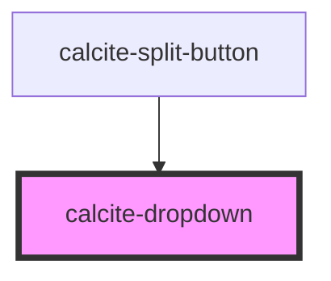

# calcite-dropdown

A `calcite-dropdown` can be used to provide an absolutely positioned set of selectable items. You can combine multiple groups of items and selection modes, and optionally pass a title for each group. All `<calcite-dropdown-item>` must have a parent `<calcite-dropdown-group>`, even if `group-title` attribute is not set.

<!-- Auto Generated Below -->

## Properties

| Property               | Attribute                 | Description                                                                                                                                                                                    | Type                               | Default     |
| ---------------------- | ------------------------- | ---------------------------------------------------------------------------------------------------------------------------------------------------------------------------------------------- | ---------------------------------- | ----------- |
| `active`               | `active`                  |                                                                                                                                                                                                | `boolean`                          | `false`     |
| `alignment`            | `alignment`               | specify the alignment of dropdown, defaults to start                                                                                                                                           | `"center" \| "end" \| "start"`     | `"start"`   |
| `disableCloseOnSelect` | `disable-close-on-select` | allow the dropdown to remain open after a selection is made if the selection-mode of the selected item's containing group is "none", the dropdown will always close                            | `boolean`                          | `false`     |
| `disabled`             | `disabled`                | is the dropdown disabled                                                                                                                                                                       | `boolean`                          | `undefined` |
| `maxItems`             | `max-items`               | specify the maximum number of calcite-dropdown-items to display before showing the scroller, must be greater than 0 - this value does not include groupTitles passed to calcite-dropdown-group | `number`                           | `0`         |
| `scale`                | `scale`                   | specify the scale of dropdown, defaults to m                                                                                                                                                   | `"l" \| "m" \| "s"`                | `"m"`       |
| `selectedItems`        | --                        | **read-only** The currently selected items                                                                                                                                                     | `HTMLCalciteDropdownItemElement[]` | `[]`        |
| `theme`                | `theme`                   | specify the theme of the dropdown, defaults to light                                                                                                                                           | `"dark" \| "light"`                | `undefined` |
| `type`                 | `type`                    | specify whether the dropdown is opened by hover or click of a trigger element                                                                                                                  | `"click" \| "hover"`               | `"click"`   |
| `width`                | `width`                   | specify the width of dropdown, defaults to m                                                                                                                                                   | `"l" \| "m" \| "s"`                | `"m"`       |

## Events

| Event                   | Description                                                   | Type                |
| ----------------------- | ------------------------------------------------------------- | ------------------- |
| `calciteDropdownClose`  | fires when a dropdown has been closed \*                      | `CustomEvent<void>` |
| `calciteDropdownOpen`   | fires when a dropdown has been opened \*                      | `CustomEvent<void>` |
| `calciteDropdownSelect` | fires when a dropdown item has been selected or deselected \* | `CustomEvent<void>` |

## Methods

### `reposition() => Promise<void>`

#### Returns

Type: `Promise<void>`

## Dependencies

### Used by

- [calcite-split-button](../calcite-split-button)

### Graph

---

_Built with [StencilJS](https://stenciljs.com/)_
