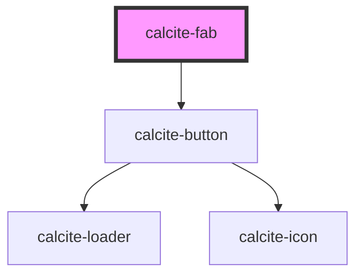

# calcite-fab

<!-- Auto Generated Below -->

## Usage

### Basic

#### Without text

Renders a `calcite-fab` that displays only an icon and a tooltip label.

```html
<calcite-fab label="Performs my custom action"></calcite-fab>
```

#### With text

Renders a `calcite-fab` that displays text along side an icon and a tooltip label.

```html
<calcite-fab label="Performs my custom action" text="Perform Action!" text-enabled></calcite-fab>
```

#### Loading and disabled

Renders a `calcite-fab` that is loading and disabled.

```html
<calcite-fab loading disabled></calcite-fab>
```

## Properties

| Property      | Attribute      | Description                                                                                                                                    | Type                                        | Default      |
| ------------- | -------------- | ---------------------------------------------------------------------------------------------------------------------------------------------- | ------------------------------------------- | ------------ |
| `appearance`  | `appearance`   | Used to set the button's appearance. Default is outline.                                                                                       | `"outline" \| "solid"`                      | `"outline"`  |
| `color`       | `color`        | Used to set the button's color. Default is light.                                                                                              | `"blue" \| "inverse" \| "neutral" \| "red"` | `"neutral"`  |
| `disabled`    | `disabled`     | When true, disabled prevents interaction. This state shows items with lower opacity/grayed.                                                    | `boolean`                                   | `false`      |
| `icon`        | `icon`         | The name of the icon to display. The value of this property must match the icon name from https://esri.github.io/calcite-ui-icons/.            | `string`                                    | `ICONS.plus` |
| `label`       | `label`        | Label of the FAB, exposed on hover when textEnabled is false. If no label is provided, the label inherits what's provided for the `text` prop. | `string`                                    | `undefined`  |
| `loading`     | `loading`      | When true, content is waiting to be loaded. This state shows a busy indicator.                                                                 | `boolean`                                   | `false`      |
| `scale`       | `scale`        | Specifies the size of the fab.                                                                                                                 | `"l" \| "m" \| "s"`                         | `"m"`        |
| `text`        | `text`         | Text that accompanies the FAB icon.                                                                                                            | `string`                                    | `undefined`  |
| `textEnabled` | `text-enabled` | Indicates whether the text is displayed.                                                                                                       | `boolean`                                   | `false`      |

## Methods

### `setFocus() => Promise<void>`

#### Returns

Type: `Promise<void>`

## Dependencies

### Depends on

- [calcite-button](../calcite-button)

### Graph



---

_Built with [StencilJS](https://stenciljs.com/)_
