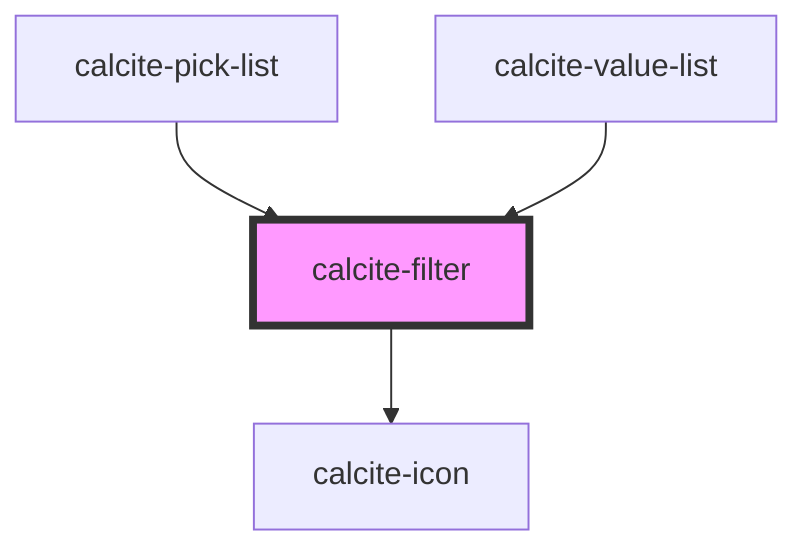

# calcite-filter

<!-- Auto Generated Below -->

## Properties

| Property      | Attribute     | Description                                                                                                                                                             | Type       | Default     |
| ------------- | ------------- | ----------------------------------------------------------------------------------------------------------------------------------------------------------------------- | ---------- | ----------- |
| `data`        | --            | The input data. The filter uses this as the starting point, and returns items that contain the string entered in the input, using a partial match and recursive search. | `object[]` | `undefined` |
| `intlClear`   | `intl-clear`  | A text label that will appear on the clear button.                                                                                                                      | `string`   | `undefined` |
| `intlLabel`   | `intl-label`  | A text label that will appear next to the input field.                                                                                                                  | `string`   | `undefined` |
| `placeholder` | `placeholder` | Placeholder text for the input element's placeholder attribute                                                                                                          | `string`   | `undefined` |

## Events

| Event                 | Description | Type               |
| --------------------- | ----------- | ------------------ |
| `calciteFilterChange` |             | `CustomEvent<any>` |

## Dependencies

### Used by

 - [calcite-pick-list](../calcite-pick-list)
 - [calcite-value-list](../calcite-value-list)

### Depends on

- [calcite-icon](../calcite-icon)

### Graph

----------------------------------------------

*Built with [StencilJS](https://stenciljs.com/)*
