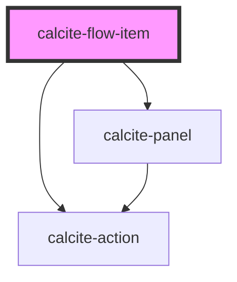

# calcite-flow-item

A `calcite-flow-item` is a child element of `calcite-flow` and lives in a panel with a heading and content.

<!-- Auto Generated Below -->

## Properties

| Property         | Attribute          | Description                                                                                               | Type                  | Default     |
| ---------------- | ------------------ | --------------------------------------------------------------------------------------------------------- | --------------------- | ----------- |
| `beforeBack`     | --                 | When provided, this method will be called before it is removed from the parent flow.                      | `() => Promise<void>` | `undefined` |
| `disabled`       | `disabled`         | When true, disabled prevents interaction. This state shows items with lower opacity/grayed.               | `boolean`             | `false`     |
| `heading`        | `heading`          | Heading text.                                                                                             | `string`              | `undefined` |
| `heightScale`    | `height-scale`     | Specifies the maxiumum height of the panel that this wraps.                                               | `"l" \| "m" \| "s"`   | `undefined` |
| `intlBack`       | `intl-back`        | 'Back' text string.                                                                                       | `string`              | `undefined` |
| `intlClose`      | `intl-close`       | 'Close' text string for the close button. The close button will only be shown when 'dismissible' is true. | `string`              | `undefined` |
| `intlOpen`       | `intl-open`        | 'Open' text string for the menu.                                                                          | `string`              | `undefined` |
| `loading`        | `loading`          | When true, content is waiting to be loaded. This state shows a busy indicator.                            | `boolean`             | `false`     |
| `menuOpen`       | `menu-open`        | Opens the action menu.                                                                                    | `boolean`             | `false`     |
| `showBackButton` | `show-back-button` | Shows a back button in the header.                                                                        | `boolean`             | `false`     |
| `summary`        | `summary`          | Summary text. A description displayed underneath the heading.                                             | `string`              | `undefined` |
| `theme`          | `theme`            | Used to set the component's color scheme.                                                                 | `"dark" \| "light"`   | `undefined` |

## Events

| Event                      | Description                                    | Type               |
| -------------------------- | ---------------------------------------------- | ------------------ |
| `calciteFlowItemBackClick` | Emitted when the back button has been clicked. | `CustomEvent<any>` |
| `calciteFlowItemScroll`    | Emitted when the content has been scrolled.    | `CustomEvent<any>` |

## Slots

| Slot               | Description                                                                                                                     |
| ------------------ | ------------------------------------------------------------------------------------------------------------------------------- |
|                    | A slot for adding content to the flow item.                                                                                     |
| `"fab"`            | A slot for adding a `calcite-fab` (floating action button) to perform an action.                                                |
| `"footer-actions"` | A slot for adding `calcite-button`s to the footer.                                                                              |
| `"menu-actions"`   | A slot for adding `calcite-action`s to a menu under the `...` in the header. These actions are displayed when the menu is open. |

## Dependencies

### Depends on

- [calcite-action](../calcite-action)
- [calcite-panel](../calcite-panel)

### Graph

---

_Built with [StencilJS](https://stenciljs.com/)_
