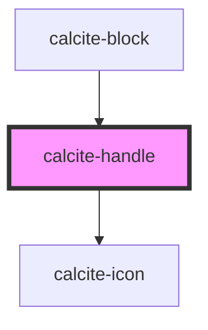

# calcite-handle

<!-- Auto Generated Below -->

## Properties

| Property    | Attribute    | Description                          | Type     | Default    |
| ----------- | ------------ | ------------------------------------ | -------- | ---------- |
| `textTitle` | `text-title` | Value for the button title attribute | `string` | `"handle"` |

## Events

| Event                | Description                                                                       | Type               |
| -------------------- | --------------------------------------------------------------------------------- | ------------------ |
| `calciteHandleNudge` | Emitted when the the handle is activated and the up or down arrow key is pressed. | `CustomEvent<any>` |

## Methods

### `setFocus() => Promise<void>`

Sets focus on the component.

#### Returns

Type: `Promise<void>`

## Dependencies

### Used by

- [calcite-block](../calcite-block)

### Depends on

- [calcite-icon](../calcite-icon)

### Graph

---

_Built with [StencilJS](https://stenciljs.com/)_
