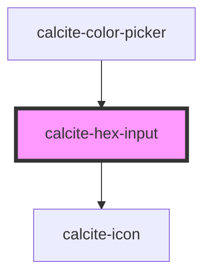

# calcite-hex-input

<!-- Auto Generated Below -->

## Properties

| Property | Attribute | Description    | Type     | Default               |
| -------- | --------- | -------------- | -------- | --------------------- |
| `value`  | `value`   | The hex value. | `string` | `DEFAULT_COLOR.hex()` |

## Events

| Event                   | Description                         | Type               |
| ----------------------- | ----------------------------------- | ------------------ |
| `calciteHexInputChange` | Emitted when the hex value changes. | `CustomEvent<any>` |

## Dependencies

### Used by

 - [calcite-color-picker](../calcite-color-picker)

### Depends on

- [calcite-icon](../calcite-icon)

### Graph

----------------------------------------------

*Built with [StencilJS](https://stenciljs.com/)*
