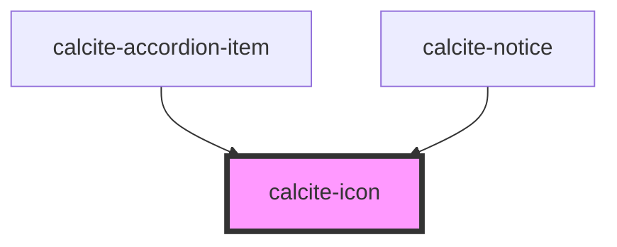

# calcite-icon

<!-- Auto Generated Below -->

## Properties

| Property   | Attribute  | Description                                                                                                                         | Type                | Default   |
| ---------- | ---------- | ----------------------------------------------------------------------------------------------------------------------------------- | ------------------- | --------- |
| `filled`   | `filled`   | When true, the icon will be filled.                                                                                                 | `boolean`           | `false`   |
| `icon`     | `icon`     | The name of the icon to display. The value of this property must match the icon name from https://esri.github.io/calcite-ui-icons/. | `string`            | `null`    |
| `mirrored` | `mirrored` | When true, the icon will be mirrored when the element direction is 'rtl'.                                                           | `boolean`           | `false`   |
| `scale`    | `scale`    | Icon scale. Can be "s" \| "m" \| "l".                                                                                               | `"l" \| "m" \| "s"` | `"m"`     |
| `theme`    | `theme`    | Icon theme. Can be "light" or "dark".                                                                                               | `"dark" \| "light"` | `"light"` |

## Dependencies

### Used by

 - [calcite-accordion-item](../calcite-accordion-item)
 - [calcite-notice](../calcite-notice)

### Graph

----------------------------------------------

*Built with [StencilJS](https://stenciljs.com/)*
