# calcite-icon

To use a custom color for the icon fill, you can add a class to the `calcite-icon` component with the desired color.

```
<calcite-icon class="my-icon-color-class" icon="arrowBoldLeft"></calcite-icon>
```

```
.my-icon-color-class {
  color: #007ac2;
}
```

<!-- Auto Generated Below -->

## Properties

| Property    | Attribute    | Description                                                                                                                         | Type                | Default     |
| ----------- | ------------ | ----------------------------------------------------------------------------------------------------------------------------------- | ------------------- | ----------- |
| `flipRtl`   | `flip-rtl`   | When true, the icon will be flipped when the element direction is 'rtl'.                                                            | `boolean`           | `false`     |
| `icon`      | `icon`       | The name of the icon to display. The value of this property must match the icon name from https://esri.github.io/calcite-ui-icons/. | `string`            | `null`      |
| `scale`     | `scale`      | Icon scale.                                                                                                                         | `"l" \| "m" \| "s"` | `"m"`       |
| `textLabel` | `text-label` | The icon label. It is recommended to set this value if your icon is semantic.                                                       | `string`            | `undefined` |
| `theme`     | `theme`      | Icon theme. Can be "light" or "dark".                                                                                               | `"dark" \| "light"` | `undefined` |

## Dependencies

### Used by

- [calcite-accordion-item](../calcite-accordion-item)
- [calcite-action](../calcite-action)
- [calcite-alert](../calcite-alert)
- [calcite-avatar](../calcite-avatar)
- [calcite-block-section](../calcite-block-section)
- [calcite-button](../calcite-button)
- [calcite-chip](../calcite-chip)
- [calcite-combobox](../calcite-combobox)
- [calcite-combobox-item](../calcite-combobox-item)
- [calcite-date-picker-month-header](../calcite-date-picker-month-header)
- [calcite-dropdown-item](../calcite-dropdown-item)
- [calcite-filter](../calcite-filter)
- [calcite-handle](../calcite-handle)
- [calcite-input](../calcite-input)
- [calcite-input-date-picker](../calcite-input-date-picker)
- [calcite-input-message](../calcite-input-message)
- [calcite-link](../calcite-link)
- [calcite-modal](../calcite-modal)
- [calcite-notice](../calcite-notice)
- [calcite-pagination](../calcite-pagination)
- [calcite-pick-list-item](../calcite-pick-list-item)
- [calcite-popover](../calcite-popover)
- [calcite-radio-group-item](../calcite-radio-group-item)
- [calcite-rating](../calcite-rating)
- [calcite-select](../calcite-select)
- [calcite-stepper-item](../calcite-stepper-item)
- [calcite-tab-title](../calcite-tab-title)
- [calcite-tile](../calcite-tile)
- [calcite-tree-item](../calcite-tree-item)
- [calcite-value-list-item](../calcite-value-list-item)

### Graph

```mermaid
graph TD;
  calcite-accordion-item --> calcite-icon
  calcite-action --> calcite-icon
  calcite-alert --> calcite-icon
  calcite-avatar --> calcite-icon
  calcite-block-section --> calcite-icon
  calcite-button --> calcite-icon
  calcite-chip --> calcite-icon
  calcite-combobox --> calcite-icon
  calcite-combobox-item --> calcite-icon
  calcite-date-picker-month-header --> calcite-icon
  calcite-dropdown-item --> calcite-icon
  calcite-filter --> calcite-icon
  calcite-handle --> calcite-icon
  calcite-input --> calcite-icon
  calcite-input-date-picker --> calcite-icon
  calcite-input-message --> calcite-icon
  calcite-link --> calcite-icon
  calcite-modal --> calcite-icon
  calcite-notice --> calcite-icon
  calcite-pagination --> calcite-icon
  calcite-pick-list-item --> calcite-icon
  calcite-popover --> calcite-icon
  calcite-radio-group-item --> calcite-icon
  calcite-rating --> calcite-icon
  calcite-select --> calcite-icon
  calcite-stepper-item --> calcite-icon
  calcite-tab-title --> calcite-icon
  calcite-tile --> calcite-icon
  calcite-tree-item --> calcite-icon
  calcite-value-list-item --> calcite-icon
  style calcite-icon fill:#f9f,stroke:#333,stroke-width:4px
```



---

_Built with [StencilJS](https://stenciljs.com/)_
