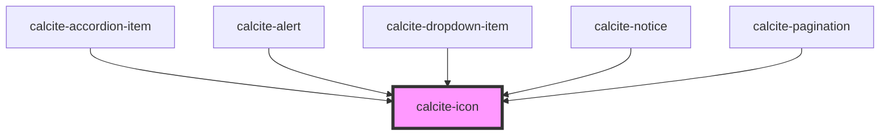

# calcite-icon

To use a custom color for the icon fill, you can add a class to the `calcite-icon` component with the desired color.

```
<calcite-icon class="my-icon-color-class" icon="arrowBoldLeft"></calcite-icon>
```

```
.my-icon-color-class {
  color: #007ac2;
}
```


<!-- Auto Generated Below -->


## Properties

| Property    | Attribute    | Description                                                                                                                         | Type                | Default     |
| ----------- | ------------ | ----------------------------------------------------------------------------------------------------------------------------------- | ------------------- | ----------- |
| `filled`    | `filled`     | When true, the icon will be filled.                                                                                                 | `boolean`           | `false`     |
| `icon`      | `icon`       | The name of the icon to display. The value of this property must match the icon name from https://esri.github.io/calcite-ui-icons/. | `string`            | `null`      |
| `mirrored`  | `mirrored`   | When true, the icon will be mirrored when the element direction is 'rtl'.                                                           | `boolean`           | `false`     |
| `scale`     | `scale`      | Icon scale. Can be "s" \| "m" \| "l".                                                                                               | `"l" \| "m" \| "s"` | `"m"`       |
| `textLabel` | `text-label` | The icon label.  It is recommended to set this value if your icon is semantic.                                                      | `string`            | `undefined` |
| `theme`     | `theme`      | Icon theme. Can be "light" or "dark".                                                                                               | `"dark" \| "light"` | `"light"`   |


## Dependencies

### Used by

 - [calcite-accordion-item](../calcite-accordion-item)
 - [calcite-alert](../calcite-alert)
 - [calcite-dropdown-item](../calcite-dropdown-item)
 - [calcite-notice](../calcite-notice)
 - [calcite-pagination](../calcite-pagination)

### Graph


----------------------------------------------

*Built with [StencilJS](https://stenciljs.com/)*
