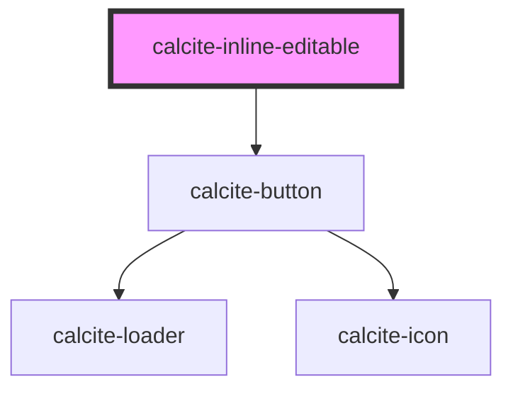

# calcite-inline-editable

<!-- Auto Generated Below -->

## Usage

### Basic

There is no need to set a theme or scale on the `<calcite-inline-editable>` component, as it inherits these values from the wrapped `<calcite-input>`, or the closest parent component where these props are set.

```html
<calcite-inline-editable>
  <calcite-input value="Entered value" placeholder="My placeholder"></calcite-input>
</calcite-inline-editable>
```

### With-label

```html
<calcite-label>
  My great label
  <calcite-inline-editable controls>
    <calcite-input value="Entered value" placeholder="My placeholder"></calcite-input>
  </calcite-inline-editable>
</calcite-label>
```

### With-save-and-cancel-controls

```html
<calcite-inline-editable controls>
  <calcite-input value="Entered value" placeholder="My placeholder"></calcite-input>
</calcite-inline-editable>
```

## Properties

| Property             | Attribute              | Description                                                                                                                                                            | Type                  | Default                    |
| -------------------- | ---------------------- | ---------------------------------------------------------------------------------------------------------------------------------------------------------------------- | --------------------- | -------------------------- |
| `afterConfirm`       | --                     | when controls, specify a callback to be executed prior to disabling editing. when provided, loading state will be handled automatically.                               | `() => Promise<void>` | `undefined`                |
| `controls`           | `controls`             | specify whether save/cancel controls should be displayed when editingEnabled is true, defaults to false                                                                | `boolean`             | `false`                    |
| `disabled`           | `disabled`             | specify whether editing can be enabled                                                                                                                                 | `boolean`             | `false`                    |
| `editingEnabled`     | `editing-enabled`      | specify whether the wrapped input element is editable, defaults to false                                                                                               | `boolean`             | `false`                    |
| `intlCancelEditing`  | `intl-cancel-editing`  | specify text to be user for the cancel editing button's aria-label, defaults to `Cancel`                                                                               | `string`              | `TEXT.intlCancelEditing`   |
| `intlConfirmChanges` | `intl-confirm-changes` | specify text to be user for the confirm changes button's aria-label, defaults to `Save`                                                                                | `string`              | `TEXT.intlConfirmChanges`  |
| `intlEnableEditing`  | `intl-enable-editing`  | specify text to be user for the enable editing button's aria-label, defaults to `Click to edit`                                                                        | `string`              | `TEXT.intlEnablingEditing` |
| `loading`            | `loading`              | specify whether the confirm button should display a loading state, defaults to false                                                                                   | `boolean`             | `false`                    |
| `scale`              | `scale`                | specify the scale of the inline-editable component, defaults to the scale of the wrapped calcite-input or the scale of the closest wrapping component with a set scale | `"l" \| "m" \| "s"`   | `undefined`                |

## Slots

| Slot | Description                            |
| ---- | -------------------------------------- |
|      | slot for rendering a `<calcite-input>` |

## Dependencies

### Depends on

- [calcite-button](../calcite-button)

### Graph



---

_Built with [StencilJS](https://stenciljs.com/)_
