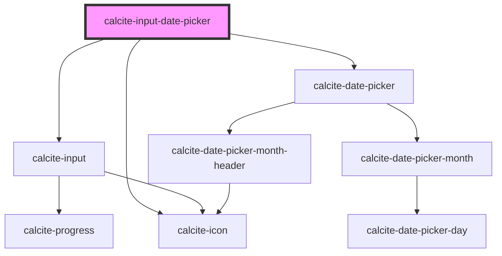

# calcite-input-date-picker

<!-- Auto Generated Below -->

## Properties

| Property                     | Attribute                      | Description                                                                                                           | Type                         | Default                                      |
| ---------------------------- | ------------------------------ | --------------------------------------------------------------------------------------------------------------------- | ---------------------------- | -------------------------------------------- |
| `active`                     | `active`                       | Expand or collapse when calendar does not have input                                                                  | `boolean`                    | `false`                                      |
| `end`                        | `end`                          | Selected end date                                                                                                     | `string`                     | `undefined`                                  |
| `endAsDate`                  | --                             | Selected end date as full date object                                                                                 | `Date`                       | `undefined`                                  |
| `intlNextMonth`              | `intl-next-month`              | Localized string for "next month" (used for aria label)                                                               | `string`                     | `TEXT.nextMonth`                             |
| `intlPrevMonth`              | `intl-prev-month`              | Localized string for "previous month" (used for aria label)                                                           | `string`                     | `TEXT.prevMonth`                             |
| `layout`                     | `layout`                       | Layout                                                                                                                | `"horizontal" \| "vertical"` | `"horizontal"`                               |
| `locale`                     | `locale`                       | BCP 47 language tag for desired language and country format                                                           | `string`                     | `document.documentElement.lang \|\| "en-US"` |
| `max`                        | `max`                          | Latest allowed date ("yyyy-mm-dd")                                                                                    | `string`                     | `undefined`                                  |
| `min`                        | `min`                          | Earliest allowed date ("yyyy-mm-dd")                                                                                  | `string`                     | `undefined`                                  |
| `proximitySelectionDisabled` | `proximity-selection-disabled` | Disables the default behaviour on the third click of narrowing or extending the range and instead starts a new range. | `boolean`                    | `false`                                      |
| `range`                      | `range`                        | Range mode activation                                                                                                 | `boolean`                    | `false`                                      |
| `scale`                      | `scale`                        | specify the scale of the date picker                                                                                  | `"l" \| "m" \| "s"`          | `"m"`                                        |
| `start`                      | `start`                        | Selected start date                                                                                                   | `string`                     | `undefined`                                  |
| `startAsDate`                | --                             | Selected start date as full date object                                                                               | `Date`                       | `undefined`                                  |
| `value`                      | `value`                        | Selected date                                                                                                         | `string`                     | `undefined`                                  |
| `valueAsDate`                | --                             | Selected date as full date object                                                                                     | `Date`                       | `undefined`                                  |

## Events

| Event                          | Description                                                     | Type                           |
| ------------------------------ | --------------------------------------------------------------- | ------------------------------ |
| `calciteDatePickerChange`      | Trigger calcite date change when a user changes the date.       | `CustomEvent<Date>`            |
| `calciteDatePickerRangeChange` | Trigger calcite date change when a user changes the date range. | `CustomEvent<DateRangeChange>` |

## Methods

### `reposition() => Promise<void>`

#### Returns

Type: `Promise<void>`

## Dependencies

### Depends on

- [calcite-input](../calcite-input)
- [calcite-date-picker](../calcite-date-picker)
- [calcite-icon](../calcite-icon)

### Graph

---

_Built with [StencilJS](https://stenciljs.com/)_
