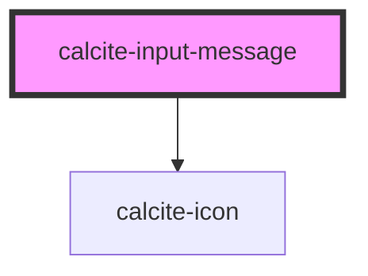

# calcite-input-message

Displays a contextual message to a user. Allows the passing of content, links, etc.

<!-- Auto Generated Below -->

## Usage

### Basic

```html
<calcite-label status="“invalid”">
  My great label
  <calcite-input placeholder="“Enter" your information”></calcite-input>
  <calcite-input-message active
    >That's not going to work out.
    <calcite-button appearance="inline" href="">Learn more</calcite-button></calcite-input-message
  >
</calcite-label>
```

## Properties

| Property | Attribute | Description                                                                                                                                             | Type                             | Default     |
| -------- | --------- | ------------------------------------------------------------------------------------------------------------------------------------------------------- | -------------------------------- | ----------- |
| `active` | `active`  |                                                                                                                                                         | `boolean`                        | `false`     |
| `icon`   | `icon`    | when used as a boolean set to true, show a default icon based on status. You can also pass a calcite-ui-icon name to this prop to display a custom icon | `boolean \| string`              | `undefined` |
| `scale`  | `scale`   | specify the scale of the input, defaults to m                                                                                                           | `"l" \| "m" \| "s"`              | `"m"`       |
| `status` | `status`  | specify the status of the input field, determines message and icons                                                                                     | `"idle" \| "invalid" \| "valid"` | `"idle"`    |
| `type`   | `type`    | specify the appearance of any slotted message - default (displayed under input), or floating (positioned absolutely under input)                        | `"default" \| "floating"`        | `"default"` |

## Dependencies

### Depends on

- [calcite-icon](../calcite-icon)

### Graph



---

_Built with [StencilJS](https://stenciljs.com/)_
