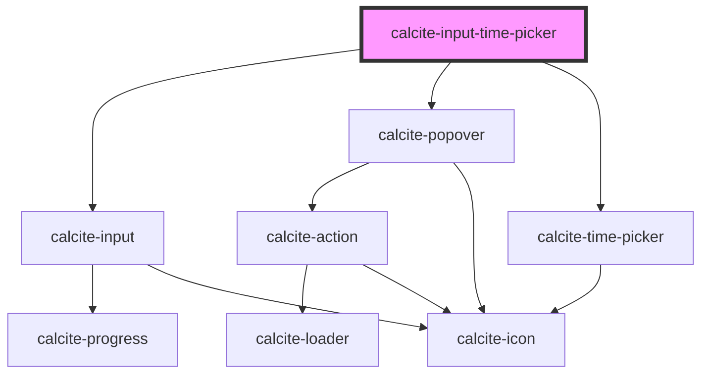

# calcite-input-time-picker

<!-- Auto Generated Below -->

## Usage

### Basic

```html
<calcite-input-time-picker
  hour-display-format="12"
  name="light"
  scale="m"
  step="1"
  value="12:21"
></calcite-input-time-picker>
```

## Properties

| Property            | Attribute             | Description                                                                                | Type                | Default     |
| ------------------- | --------------------- | ------------------------------------------------------------------------------------------ | ------------------- | ----------- |
| `active`            | `active`              | The active state of the time input                                                         | `boolean`           | `false`     |
| `disabled`          | `disabled`            | The disabled state of the time input                                                       | `boolean`           | `false`     |
| `hourDisplayFormat` | `hour-display-format` | Format of the hour value (12-hour or 24-hour) (this will be replaced by locale eventually) | `"12" \| "24"`      | `"12"`      |
| `intlHour`          | `intl-hour`           | aria-label for the hour input                                                              | `string`            | `undefined` |
| `intlHourDown`      | `intl-hour-down`      | aria-label for the hour down button                                                        | `string`            | `undefined` |
| `intlHourUp`        | `intl-hour-up`        | aria-label for the hour up button                                                          | `string`            | `undefined` |
| `intlMeridiem`      | `intl-meridiem`       | aria-label for the meridiem (am/pm) input                                                  | `string`            | `undefined` |
| `intlMeridiemDown`  | `intl-meridiem-down`  | aria-label for the meridiem (am/pm) down button                                            | `string`            | `undefined` |
| `intlMeridiemUp`    | `intl-meridiem-up`    | aria-label for the meridiem (am/pm) up button                                              | `string`            | `undefined` |
| `intlMinute`        | `intl-minute`         | aria-label for the minute input                                                            | `string`            | `undefined` |
| `intlMinuteDown`    | `intl-minute-down`    | aria-label for the minute down button                                                      | `string`            | `undefined` |
| `intlMinuteUp`      | `intl-minute-up`      | aria-label for the minute up button                                                        | `string`            | `undefined` |
| `intlSecond`        | `intl-second`         | aria-label for the second input                                                            | `string`            | `undefined` |
| `intlSecondDown`    | `intl-second-down`    | aria-label for the second down button                                                      | `string`            | `undefined` |
| `intlSecondUp`      | `intl-second-up`      | aria-label for the second up button                                                        | `string`            | `undefined` |
| `name`              | `name`                | The name of the time input                                                                 | `string`            | `undefined` |
| `scale`             | `scale`               | The scale (size) of the time input                                                         | `"l" \| "m" \| "s"` | `"m"`       |
| `step`              | `step`                | number that specifies the granularity that the value must adhere to                        | `number`            | `60`        |
| `value`             | `value`               | The selected time                                                                          | `string`            | `null`      |

## Events

| Event                          | Description                                                     | Type                  |
| ------------------------------ | --------------------------------------------------------------- | --------------------- |
| `calciteInputTimePickerChange` | Fires when the time value is changed as a result of user input. | `CustomEvent<string>` |

## Methods

### `setFocus() => Promise<void>`

Sets focus on the component.

#### Returns

Type: `Promise<void>`

## Dependencies

### Depends on

- [calcite-input](../calcite-input)
- [calcite-popover](../calcite-popover)
- [calcite-time-picker](../calcite-time-picker)

### Graph



---

_Built with [StencilJS](https://stenciljs.com/)_
