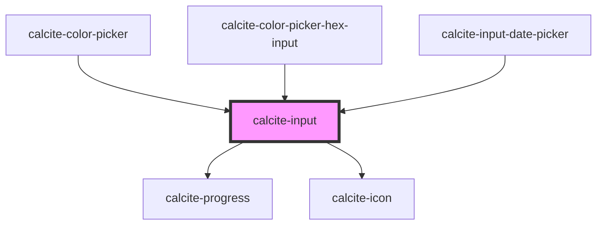

# calcite-input

### Attributes

#### Custom attributes

`status` = [`idle`, `valid`, `invalid`] - defaults to `idle` - Allows setting a status that affects styling of input. This can also be explicitly set on a `calcite-input-message` component or on a wrapping `calcite-input`. Setting `status` on the `calcite-label` will propagate to any child `calcite-input` or `calcite-input-message` components

`loading` = boolean - defaults to `false`

`alignment` = [`start`/`end`] - defaults to `start` - specify the alignment of the value / placeholder inside the input. Useful for aligning numbers, etc.

`icon` = boolean / string - defaults to false. You can use "icon" to default to a recommended icon for that field type (will only work on `tel`, `email`, `password`, `search`, `date`, `time`). You can also pass a valid calcite ui icon string to set a custom icon. We recommend using "icon" / default icon on the above field types for consistency across apps.

`prefix-string` and `suffix-string` allow you position strings in a leading and trailing position.

#### Native attributes

In addition to custom attributes, you can pass any attribute to `<calcite-input>` you could to a native input element:

`autofocus` = [`true`/`false]`- defaults to`false`

`required` = [`true`/`false`] - defaults to `false`

`type` = [`text`/`textarea`/`number`/`file`/`tel`/`email`/`password`•/`search`] - defaults to `text`

- `textarea` type is available as a type of `calcite-input` because the structure and style of an input and a textarea are so similar - you can pass content to a textarea `<calcite-input type=textarea>text area content</div>` and value to an input `<calcite-input value=">`

- `number` type replaces browser "increment" and "decrement" arrows with custom replacements

- `file` type replaces browser "file" input with custom replacement

- `tel`, `email`, `password`, `search`, `date`, `time` types will add type-specific icons by default

### Slots

- a `calcite-action` slot is available for positioning a button next ot an input

### Events

#### Custom events

You can listen for the following custom events from emitted `<calcite-input>`:

All events return an element and a value:

```
  input.addEventListener("calciteInputChange", logChange);
  input.addEventListener("calciteInputFocus", logChange);
  input.addEventListener("calciteInputBlur", logChange);

  function logChange() {
      console.log(event.detail.element)
      console.log(event.detail.value)
  }
```

#### Native events

You can also listen for native events emitted from `<calcite-input>`:

You must use `focusin`/`focusout` instead of `focus`/`blur`because these events bubble up from the rendered child element rendered inside of `<calcite-input>`

All events return an element and a value:

```
  input.addEventListener(“change”, logChange);
  input.addEventListener(“focusin”, logFocus);
  input.addEventListener(“focusout”, logBlur);

    function logChange() {
      console.log(event.target.element)
      console.log(event.target.value)
  }
```

### Usage

#### Structure

##### Basic

```
<calcite-input value="Entered value" placeholder="My placeholder"></calcite-input>
```

##### With a label

It's recommended that you use a wrapping `calcite-label` component:

```
<calcite-label>
    My great label
    <calcite-input value="Entered value" placeholder="My placeholder"></calcite-input>
</calcite-label>
```

##### With a message

```
<calcite-label status="valid">
    My great label
    <calcite-input placeholder=“Enter your information”></calcite-input>
    <calcite-input-message active>Here’s something you should know about this input</calcite-input-message>
</calcite-label>
```

##### Label Usage

Using a wrapping `calcite-input` component lets consumers set the status attribute once and have it propagate to any child elements

```
<calcite-label>
    My great label
    <calcite-input status=“invalid” placeholder=“Enter your information”></calcite-input>
    <calcite-input-message status=“invalid” active>Here’s something you should know about this input</calcite-input-message>
</calcite-label>
```

<!-- Auto Generated Below -->

## Properties

| Property           | Attribute            | Description                                                                                                                                                                                                                                  | Type                                                                                                                                                                                   | Default      |
| ------------------ | -------------------- | -------------------------------------------------------------------------------------------------------------------------------------------------------------------------------------------------------------------------------------------- | -------------------------------------------------------------------------------------------------------------------------------------------------------------------------------------- | ------------ |
| `alignment`        | `alignment`          | specify the alignment of the value of the input                                                                                                                                                                                              | `"end" \| "start"`                                                                                                                                                                     | `"start"`    |
| `autofocus`        | `autofocus`          | should the input autofocus                                                                                                                                                                                                                   | `boolean`                                                                                                                                                                              | `false`      |
| `clearable`        | `clearable`          | optionally display a clear button that displays when field has a value shows by default for search, time, date will not display for type="textarea"                                                                                          | `boolean`                                                                                                                                                                              | `undefined`  |
| `disabled`         | `disabled`           | is the input disabled                                                                                                                                                                                                                        | `boolean`                                                                                                                                                                              | `undefined`  |
| `icon`             | `icon`               | when used as a boolean set to true, show a default recommended icon for certain input types (tel, password, email, date, time, search). You can also pass a calcite-ui-icon name to this prop to display a requested icon for any input type | `boolean \| string`                                                                                                                                                                    | `undefined`  |
| `iconFlipRtl`      | `icon-flip-rtl`      | flip the icon in rtl                                                                                                                                                                                                                         | `boolean`                                                                                                                                                                              | `undefined`  |
| `loading`          | `loading`            | specify if the input is in loading state                                                                                                                                                                                                     | `boolean`                                                                                                                                                                              | `false`      |
| `max`              | `max`                | input max                                                                                                                                                                                                                                    | `number`                                                                                                                                                                               | `undefined`  |
| `min`              | `min`                | input min                                                                                                                                                                                                                                    | `number`                                                                                                                                                                               | `undefined`  |
| `numberButtonType` | `number-button-type` | specify the placement of the number buttons                                                                                                                                                                                                  | `"horizontal" \| "none" \| "vertical"`                                                                                                                                                 | `"vertical"` |
| `placeholder`      | `placeholder`        | explicitly whitelist placeholder attribute                                                                                                                                                                                                   | `string`                                                                                                                                                                               | `undefined`  |
| `prefixText`       | `prefix-text`        | optionally add prefix                                                                                                                                                                                                                        | `string`                                                                                                                                                                               | `undefined`  |
| `required`         | `required`           | is the input required                                                                                                                                                                                                                        | `boolean`                                                                                                                                                                              | `false`      |
| `scale`            | `scale`              | specify the scale of the input, defaults to m                                                                                                                                                                                                | `"l" \| "m" \| "s"`                                                                                                                                                                    | `"m"`        |
| `status`           | `status`             | specify the status of the input field, determines message and icons                                                                                                                                                                          | `"idle" \| "invalid" \| "valid"`                                                                                                                                                       | `"idle"`     |
| `step`             | `step`               | input step                                                                                                                                                                                                                                   | `"any" \| number`                                                                                                                                                                      | `undefined`  |
| `suffixText`       | `suffix-text`        | optionally add suffix \*                                                                                                                                                                                                                     | `string`                                                                                                                                                                               | `undefined`  |
| `theme`            | `theme`              | specify the alignment of dropdown, defaults to left                                                                                                                                                                                          | `"dark" \| "light"`                                                                                                                                                                    | `undefined`  |
| `type`             | `type`               | specify the input type                                                                                                                                                                                                                       | `"color" \| "date" \| "datetime-local" \| "email" \| "file" \| "image" \| "month" \| "number" \| "password" \| "search" \| "tel" \| "text" \| "textarea" \| "time" \| "url" \| "week"` | `"text"`     |
| `value`            | `value`              | input value                                                                                                                                                                                                                                  | `string`                                                                                                                                                                               | `""`         |

## Events

| Event               | Description | Type               |
| ------------------- | ----------- | ------------------ |
| `calciteInputBlur`  |             | `CustomEvent<any>` |
| `calciteInputFocus` |             | `CustomEvent<any>` |
| `calciteInputInput` |             | `CustomEvent<any>` |

## Methods

### `setFocus() => Promise<void>`

focus the rendered child element

#### Returns

Type: `Promise<void>`

## Dependencies

### Used by

- [calcite-color-picker](../calcite-color-picker)
- [calcite-color-picker-hex-input](src/components/calcite-color-picker-hex-input)
- [calcite-input-date-picker](../calcite-input-date-picker)

### Depends on

- [calcite-progress](../calcite-progress)
- [calcite-icon](../calcite-icon)

### Graph



---

_Built with [StencilJS](https://stenciljs.com/)_
