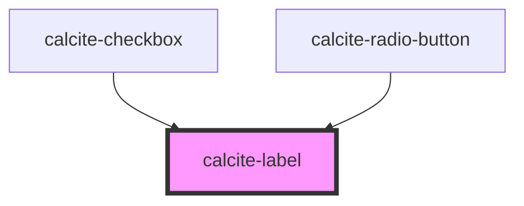

# calcite-label

Renders a `<label>` around its children and can be used with any [labelable native](https://developer.mozilla.org/en-US/docs/Web/Guide/HTML/Content_categories#Form_labelable) or labelable calcite element.

## Caveat when using with browsers that don't support flex gap

When using the `default`, `inline` or `inline-space-between` layout option with [browsers that do not support the CSS `gap` property when used with flexbox](https://caniuse.com/flexbox-gap), you will need to use the `disable-spacing` attribute and apply spacing manually to the label by wrapping it in a styled span like so:

```
<calcite-label layout="inline" disable-spacing>
  <span style="margin-right: 0.75rem">Text leading inline</span>
  <calcite-checkbox></calcite-checkbox>
</calcite-label>
```

## Status Property

It also allows consumers to set a `status` attribute for child `calcite-input` and `calcite-input-message` components to use to set their own properties.

```
<calcite-label status=“invalid”>
    My great label
    <calcite-input placeholder=“Enter your information”></calcite-input>
    <calcite-input-message active>That's not going to work out. <calcite-button layout="inline" href="">Learn more</calcite-button></calcite-input-message>
</calcite-label>
```

### Attributes

#### Custom attributes

`status` = [`idle`, `valid`, `invalid`] - defaults to `idle` - Allows setting a status that affects styling of input. This will propagate to any child `calcite-input` or `calcite-input-message` components.

<!-- Auto Generated Below -->

## Properties

| Property         | Attribute         | Description                                                          | Type                                              | Default     |
| ---------------- | ----------------- | -------------------------------------------------------------------- | ------------------------------------------------- | ----------- |
| `disableSpacing` | `disable-spacing` | Turn off spacing around the label                                    | `boolean`                                         | `undefined` |
| `disabled`       | `disabled`        | is the label disabled                                                | `boolean`                                         | `undefined` |
| `for`            | `for`             | The id of the input associated with the label                        | `string`                                          | `undefined` |
| `layout`         | `layout`          | is the wrapped element positioned inline with the label slotted text | `"default" \| "inline" \| "inline-space-between"` | `"default"` |
| `scale`          | `scale`           | specify the scale of the input, defaults to m                        | `"l" \| "m" \| "s"`                               | `"m"`       |
| `status`         | `status`          | specify the status of the label and any child input / input messages | `"idle" \| "invalid" \| "valid"`                  | `"idle"`    |
| `theme`          | `theme`           | specify theme of the label and its any child input / input messages  | `"dark" \| "light"`                               | `undefined` |

## Events

| Event               | Description | Type                        |
| ------------------- | ----------- | --------------------------- |
| `calciteLabelFocus` |             | `CustomEvent<FocusRequest>` |

## Dependencies

### Used by

- [calcite-checkbox](../calcite-checkbox)
- [calcite-radio-button](../calcite-radio-button)

### Graph



---

_Built with [StencilJS](https://stenciljs.com/)_
