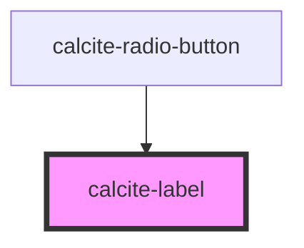

# calcite-label

Functions as a wrapper component for `calcite-input` and `calcite-input-message`. It can also be used with native `input` elements (this probably needs some testing) with the `for=` attribute.

It allows consumers to set a `status` attribute that child `calcite-input` and `calcite-input-message` components to use to set their own properties.

```
<calcite-label status=“invalid”>
    My great label
    <calcite-input placeholder=“Enter your information”></calcite-input>
    <calcite-input-message active>That's not going to work out. <calcite-button layout="inline" href="">Learn more</calcite-button></calcite-input-message>
</calcite-label>
```

### Attributes

#### Custom attributes

`status` = [`idle`, `valid`, `invalid`] - defaults to `idle` - Allows setting a status that affects styling of input. This will propagate to any child `calcite-input` or `calcite-input-message` components.

<!-- Auto Generated Below -->

## Properties

| Property | Attribute | Description                                                          | Type                                              | Default     |
| -------- | --------- | -------------------------------------------------------------------- | ------------------------------------------------- | ----------- |
| `layout` | `layout`  | is the wrapped element positioned inline with the label slotted text | `"default" \| "inline" \| "inline-space-between"` | `"default"` |
| `scale`  | `scale`   | specify the scale of the input, defaults to m                        | `"l" \| "m" \| "s"`                               | `"m"`       |
| `status` | `status`  | specify the status of the label and any child input / input messages | `"idle" \| "invalid" \| "valid"`                  | `"idle"`    |
| `theme`  | `theme`   | specify theme of the label and its any child input / input messages  | `"dark" \| "light"`                               | `"light"`   |

## Events

| Event                       | Description | Type               |
| --------------------------- | ----------- | ------------------ |
| `calciteLabelSelectedEvent` |             | `CustomEvent<any>` |

## Dependencies

### Used by

- [calcite-radio-button](../calcite-radio-button)

### Graph



---

_Built with [StencilJS](https://stenciljs.com/)_
