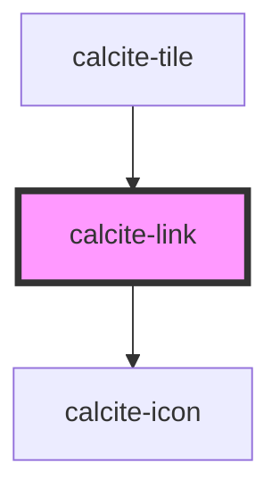

# calcite-link

You can programmatically focus a `calcite-link` with the `setFocus()` method:

`
Focus!
`

<!-- Auto Generated Below -->

## Properties

| Property      | Attribute       | Description                                                                                      | Type                         | Default     |
| ------------- | --------------- | ------------------------------------------------------------------------------------------------ | ---------------------------- | ----------- |
| `disabled`    | `disabled`      | is the link disabled                                                                             | `boolean`                    | `undefined` |
| `href`        | `href`          | optionally pass a href - used to determine if the component should render as a link or an anchor | `string`                     | `undefined` |
| `iconEnd`     | `icon-end`      | optionally pass an icon to display at the end of a button - accepts calcite ui icon names        | `string`                     | `undefined` |
| `iconFlipRtl` | `icon-flip-rtl` | flip the icon(s) in rtl                                                                          | `"both" \| "end" \| "start"` | `undefined` |
| `iconStart`   | `icon-start`    | optionally pass an icon to display at the start of a button - accepts calcite ui icon names      | `string`                     | `undefined` |
| `theme`       | `theme`         | Select theme (light or dark)                                                                     | `"dark" \| "light"`          | `undefined` |

## Methods

### `setFocus() => Promise<void>`

#### Returns

Type: `Promise<void>`

## Dependencies

### Used by

- [calcite-tile](../calcite-tile)

### Depends on

- [calcite-icon](../calcite-icon)

### Graph

---

_Built with [StencilJS](https://stenciljs.com/)_
