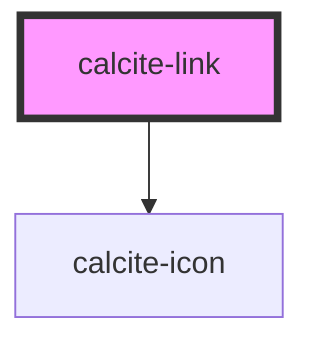

# calcite-link

You can programmatically focus a `calcite-link` with the `setFocus()` method:

`
Focus!
`

<!-- Auto Generated Below -->

## Properties

| Property       | Attribute       | Description                                                                                      | Type                                   | Default     |
| -------------- | --------------- | ------------------------------------------------------------------------------------------------ | -------------------------------------- | ----------- |
| `color`        | `color`         | specify the color of the link, defaults to blue                                                  | `"blue" \| "dark" \| "light" \| "red"` | `"blue"`    |
| `disabled`     | `disabled`      | is the link disabled                                                                             | `boolean`                              | `undefined` |
| `href`         | `href`          | optionally pass a href - used to determine if the component should render as a link or an anchor | `string`                               | `undefined` |
| `icon`         | `icon`          | optionally pass an icon to display - accepts Calcite UI icon names                               | `string`                               | `undefined` |
| `iconPosition` | `icon-position` | optionally used with icon, select where to position the icon                                     | `"end" \| "start"`                     | `"start"`   |
| `theme`        | `theme`         | Select theme (light or dark)                                                                     | `"dark" \| "light"`                    | `"light"`   |

## Methods

### `setFocus() => Promise<void>`

#### Returns

Type: `Promise<void>`

## Dependencies

### Depends on

- [calcite-icon](../calcite-icon)

### Graph

---

_Built with [StencilJS](https://stenciljs.com/)_
