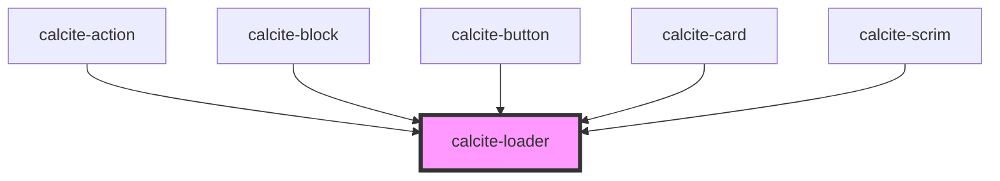

# calcite-loader

The `calcite-loader` component can act as a determinate or indeterminate loading indicator.

<!-- Auto Generated Below -->

## Properties

| Property             | Attribute    | Description                                                        | Type                               | Default     |
| -------------------- | ------------ | ------------------------------------------------------------------ | ---------------------------------- | ----------- |
| `active`             | `active`     | Show the loader                                                    | `boolean`                          | `false`     |
| `inline`             | `inline`     | Inline loaders are smaller and will appear to the left of the text | `boolean`                          | `false`     |
| `label` _(required)_ | `label`      | Accessible name for the component                                  | `string`                           | `undefined` |
| `noPadding`          | `no-padding` | Turn off spacing around the loader                                 | `boolean`                          | `undefined` |
| `scale`              | `scale`      | Speficy the scale of the loader. Defaults to "m"                   | `"l" \| "m" \| "s"`                | `"m"`       |
| `text`               | `text`       | Text which should appear under the loading indicator (optional)    | `string`                           | `""`        |
| `type`               | `type`       | Use indeterminate if finding actual progress value is impossible   | `"determinate" \| "indeterminate"` | `undefined` |
| `value`              | `value`      | Percent complete of 100, only valid for determinate indicators     | `number`                           | `0`         |

## Dependencies

### Used by

- [calcite-action](../calcite-action)
- [calcite-block](../calcite-block)
- [calcite-button](../calcite-button)
- [calcite-card](../calcite-card)
- [calcite-scrim](../calcite-scrim)

### Graph

---

_Built with [StencilJS](https://stenciljs.com/)_
