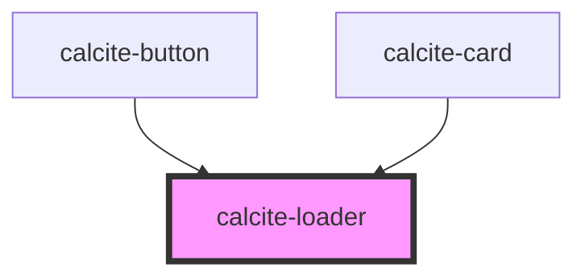

# calcite-loader

The calcite-loader component can act as a determinate or indeterminate loading indicator. Use the `is-active` attribute to toggle visibility:

```html
<calcite-loader text="Fetching data..." is-active></calcite-loader>
```

If you can calculate your progress, it's best to use the determinate version of the loader. Update the `value` of the element when progress is made:

```html
<calcite-loader type="determinate" value="32" is-active></calcite-loader>
```

The above will display a progress bar along the perimeter of the loader showing 32% complete.

For instances when you don't have room for the full loader, you can use the smaller `inline` version of the loader. The inline version is meant to sit to the left of text:

```html
<p>
  <calcite-loader is-active inline></calcite-loader> Inline loader
</p>
```

<!-- Auto Generated Below -->


## Properties

| Property    | Attribute    | Description                                                        | Type                               | Default     |
| ----------- | ------------ | ------------------------------------------------------------------ | ---------------------------------- | ----------- |
| `inline`    | `inline`     | Inline loaders are smaller and will appear to the left of the text | `boolean`                          | `false`     |
| `isActive`  | `is-active`  | Show the loader                                                    | `boolean`                          | `false`     |
| `noPadding` | `no-padding` | Turn off spacing around the loader                                 | `boolean`                          | `undefined` |
| `text`      | `text`       | Text which should appear under the loading indicator (optional)    | `string`                           | `""`        |
| `type`      | `type`       | Use indeterminate if finding actual progress value is impossible   | `"determinate" \| "indeterminate"` | `undefined` |
| `value`     | `value`      | Percent complete of 100, only valid for determinate indicators     | `number`                           | `0`         |


## Dependencies

### Used by

 - [calcite-button](../calcite-button)
 - [calcite-card](../calcite-card)

### Graph


----------------------------------------------

*Built with [StencilJS](https://stenciljs.com/)*
